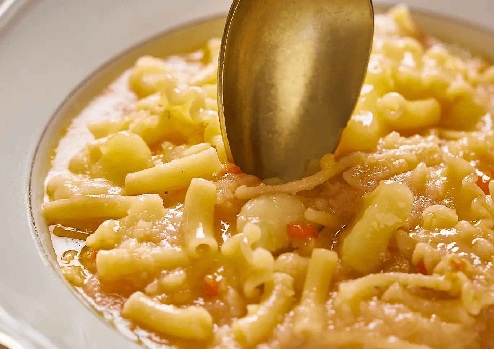

---
tags:
  - Patate
  - Provola
---

## Ingredienti

| Ingredienti                  | Ingredienti             |
| ---------------------------- | ----------------------- |
| **200 g** - Pasta mista | **600 g** - Patate |
| **200 g** - Provola | **2** - Carote |
| **1 costa** - Sedano | **1** - Cipolla bianca |
| **1 cucchiaino** - Concentrato di pomodoro | **1 rametto** - Rosmarino |
| **4 cucchiai** - olio evo | Sale e pepe |

## Procedimento

1. Sbucciare le patate e tagliarle a tocchetti di egual misura.
1. Mondare sedano, carota e cipolla e tritarli finemente, quindi trasferire il misto per soffritto ottenuto in una pentola dai bordi alti, aggiungere 3 cucchiai d’olio EVO e lasciar stufare a fiamma bassa per 2-3 minuti.
1. Unire le patate e il concentrato di pomodoro, mescolare con cura e irrorare con 500 ml di acqua calda. Regolare di sale e pepe, coprire con il coperchio e cuocere 30 minuti.
1. Schiacciare metà delle patate con una forchetta, versare 250ml di acqua bollente e unire la pasta mista. Cuocere per 8 minuti, regolare di sale e aggiungere acqua se necessaria.
1. A fuoco spento aggiungere la provola a dadini e far riposare con coperchio per 2 minuti.
1. Mantecare e infine servire con pepe nero macinato fresco e un filo d’olio EVO.

## Origine

[link](https://www.voiello.it/ricette/la-pasta-mista-n-126-e-patate/)

