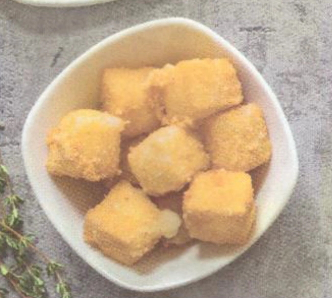

---
tags:
  - Asiago
---
# Bocconcini di Asiago fritti

## Ingredienti

| Ingredienti                  | Ingredienti             |
| ---------------------------- | ----------------------- |
| **300 g** - Asiago | Sale |
| Farina 00 | Pangrattato |
| **1** - Uovo | Olio di semi |

## Procedimento

1. Tagliate l'Asiago a cubetti di circa 2cm di lato. Passate i cubetti di formaggio prima nella farina e poi in un piatto fondo con dell'uovo sbattuto insieme a un pizzico di sale.
1. Una volta scolati i cubetti dall'uovo in eccesso, finiamo la panatura nel pangrattato.
1. Friggete i bocconcini panati in una padella capiente con dell'olio di semi ben caldo. Scolate il formaggio quando sarà dorato su una teglia foderata di carta assorbente.
