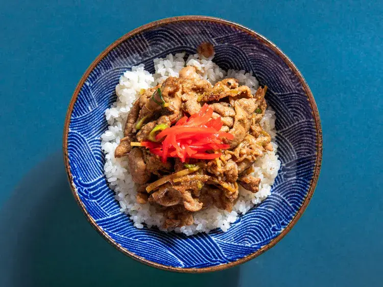

---
tags:
  - Maiale
  - Zenzero
  - Giapponese
---
# Buta Shogayaki (Japanese Ginger Pork)

## Ingredienti

| Ingredienti | Ingredienti |
| --- | --- |
| **72 g** - Zenzero fresco (2 pezzi da 5 cm), 1 pezzo grattugiato e 1 tagliato a julienne | **30 ml** - Salsa di soia |
| **30 ml** - Mirin | **15 ml** - Sake |
| **1/8 cucchiaino** - Pepe bianco macinato | **454 g** - Spalla di maiale tagliata a fettine sottili (circa 3 mm) |
| **30 ml** - Olio neutro (es. di semi), diviso | **2** - Cipollotti affettati sottili |
| Riso a chicco corto cotto per servire | Kizami shoga per guarnire (opzionale) |

## Procedimento

1. In una ciotola media, mescolare lo zenzero grattugiato, la salsa di soia, il mirin, il sake e il pepe bianco. Aggiungere il maiale a fettine e mescolare per ricoprire ogni pezzo. Marinare per almeno 15 minuti e non più di 30 minuti.
2. In un wok o padella in ghisa da 25 cm, scaldare 1 cucchiaio di olio a fuoco alto fino a quando inizia a fumare. Aggiungere metà del maiale marinato, distribuendolo in un singolo strato uniforme, e cuocere senza mescolare per 1 minuto. Mescolare con una spatola o pinze, poi continuare a cuocere, girando e mescolando, fino a cottura completa, circa 1 minuto ancora. Trasferire in un piatto.
3. Ripetere con l'olio e il maiale rimanenti. Rimettere il primo lotto di maiale e i suoi succhi nella padella.
4. Aggiungere lo zenzero a julienne e cuocere, mescolando costantemente, fino a quando è profumato, circa 30 secondi. Spegnere il fuoco, aggiungere i cipollotti mescolando per combinare.
5. Servire immediatamente con riso e kizami shoga.

## Note

- La spalla di maiale a fettine sottili si trova nei supermercati asiatici. Se non disponibile, si possono usare filetto, lombo o fettine di maiale tagliate a striscioline sottili.
- Il kizami shoga è zenzero in salamoia tagliato a julienne, tipicamente colorato di rosso vivo. Si trova nei negozi specializzati.
- Il sake può essere sostituito con vino Shaoxing o, in mancanza, un vino bianco secco.
- Il maiale cotto si conserva in frigo in contenitore ermetico fino a una settimana. È ottimo servito freddo su riso caldo come pranzo leggero.

## Origine

[Japanese Ginger Pork (Butaniku no Shogayaki) - Serious Eats](https://www.seriouseats.com/pork-ginger-buta-shogayaki-recipe-5208113)
