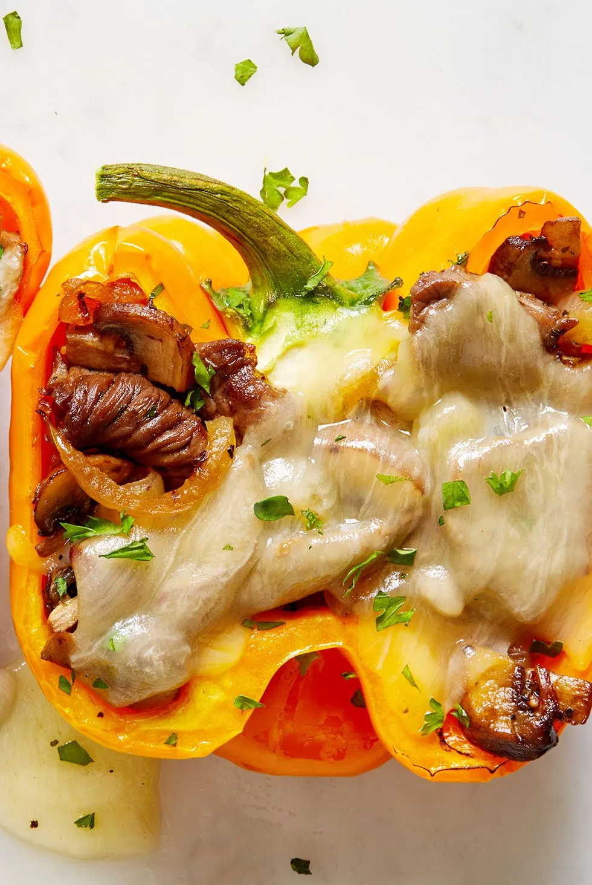

# Cheesesteak Stuffed Peppers

## Ingredienti

| Ingredienti                          | Ingredienti                                   |
| ------------------------------------ | --------------------------------------------- |
| **4** bell peppers, halved           | **q.b.** Freshly ground black pepper          |
| **1 tbsp.** vegetable oil            | **1,5 lb.** sirloin steak, thinly sliced      |
| **1** large onion, sliced            | **2 tsp.** Italian seasoning                  |
| **16 oz.** cremini mushrooms, sliced | **16** slices provolone                       |
| **q.b.** Kosher salt                 | **q.b.** Freshly chopped parsley, for garnish |

## Procedimento

> Preriscaldare il forno a 160°

1. Place peppers in a large baking dish and bake until tender, 30 minutes.
2. Meanwhile, in a large skillet over medium-high heat, heat oil. Add onions and mushrooms and season with salt and pepper. Cook until soft, 6 minutes.
3. Add steak and season with more salt and pepper.
4. Cook, stirring occasionally, 3 minutes.
5. Stir in Italian seasoning.
6. Add provolone to bottom of baked peppers and top with steak mixture.
7. Top with another piece of provolone and broil until golden, 3 minutes
8. Garnish with parsley before serving.
