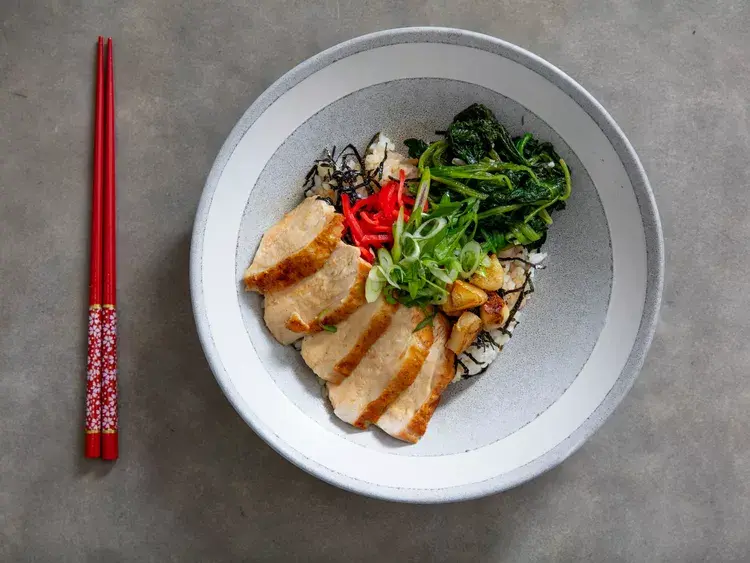

---
tags:
  - pollo
  - giapponese
  - riso
---

# Chicken Donburi (Japanese Rice Bowl) With Spinach

## Ingredienti

| Ingredienti | Ingredienti |
| --- | --- |
| **1 cucchiaio (15 ml)** - olio di canola o altro olio neutro | **9 spicchi medi** - aglio, 8 tagliati a metà e 1 tritato finemente |
| **1 mazzo (280 g)** - spinaci, lavati accuratamente e asciugati | **sale kosher** - q.b. |
| **1/2 cucchiaino (2.5 ml)** - olio di sesamo | **1/2 cucchiaino (2.5 ml)** - aceto di riso |
| **2** - petti di pollo con pelle, disossati (circa 200 g ciascuno); oppure 2 sovracosce (140 g ciascuna) e 2 fusi (80 g ciascuno) disossati con pelle | **1/4 cucchiaino (1 ml)** - maionese (opzionale) |
| **1/4 di tazza (60 ml)** - sake | **1/4 di tazza (60 ml)** - dashi, istantaneo o fatto in casa |
| **1/4 di tazza (60 ml)** - salsa di soia | **2 cucchiai (30 ml)** - mirin |
| **1/2 cucchiaino** - amido di mais, sciolto in 1 cucchiaio (15 ml) di acqua | **1 cucchiaio (15 g)** - burro non salato |

### Per servire

| Ingredienti | Ingredienti |
| --- | --- |
| **6 tazze** - riso giapponese a chicco corto, cotto | **kizami nori** - (opzionale) |
| **4** - tuorli d'uovo (opzionale) | **2 medi** - cipollotti (40 g), affettati sottilmente |
| **kizami beni shoga** - zenzero in salamoia a strisce (opzionale) | |

## Procedimento

1. In una padella di ghisa da 25 cm, scaldare l'olio a fuoco medio fino a quando inizia appena a brillare. Aggiungere l'aglio affettato e cuocere, mescolando frequentemente, fino a quando l'aglio è dorato su tutti i lati, circa 7 minuti, facendo attenzione a non bruciare nessun pezzo. Rimuovere l'aglio e metterlo da parte.

2. Aggiungere gli spinaci alla padella, condire con sale e cuocere, mescolando frequentemente, fino a quando sono appassiti e per lo più asciutti, circa 5 minuti. Spegnere il fuoco, aggiungere lo spicchio di aglio tritato rimanente e mescolare fino a quando l'aglio tritato diventa profumato, circa 30 secondi. Aggiungere l'olio di sesamo e l'aceto e mescolare per combinare. Trasferire gli spinaci su un piatto e pulire la padella con un canovaccio pulito (non è necessario lavare).

3. **Se si usano i petti di pollo:** Rimettere la padella a fuoco medio-alto e scaldare fino a quando inizia appena a fumare. Nel frattempo, spalmare la pelle del pollo con un sottile strato di maionese, se si usa (altrimenti procedere con la ricetta). Salare i petti, poi aggiungerli alla padella con la pelle verso il basso; per una doratura ottimale, posizionare un peso da cucina sopra ogni petto (opzionale). Cuocere fino a quando la pelle è ben dorata e croccante, circa 5 minuti. Girare i petti, abbassare il fuoco a medio-basso e continuare a cuocere fino a quando un termometro inserito nella parte più spessa del petto segna 65°C, circa 6 minuti. Trasferire i petti su un piatto a riposare.

4. **Se si usano sovracosce e fusi:** Rimettere la padella a fuoco medio-alto e scaldare fino a quando inizia appena a fumare. Nel frattempo, spalmare la pelle del pollo con un sottile strato di maionese, se si usa (altrimenti procedere con la ricetta). Salare il pollo, poi aggiungerlo alla padella con la pelle verso il basso; per una doratura ottimale, posizionare un peso da cucina sopra ogni pezzo di pollo (opzionale). Cuocere fino a quando la pelle è ben dorata e croccante, circa 6 minuti. Girare il pollo e continuare a cuocere fino a quando un termometro inserito nella parte più spessa delle sovracosce e dei fusi segna 71°C, circa 1 minuto in più per i fusi e 3 minuti in più per le sovracosce. Man mano che ogni pezzo di pollo raggiunge la cottura, trasferirlo su un piatto a riposare.

5. Nel frattempo, aggiungere il sake alla padella e cuocere, raschiando i residui di cottura sul fondo della padella, fino a quando il sake non profuma più di alcol, circa 1 minuto. Aggiungere il dashi, la salsa di soia, il mirin e l'aglio affettato riservato. Portare il liquido a ebollizione, poi ridurre il fuoco a medio-basso e lasciar sobbollire fino a quando si è leggermente ridotto e gli spicchi d'aglio sono completamente cotti, circa 4 minuti. Aggiungere la miscela di amido di mais in piccoli incrementi alla padella, facendo una pausa tra ogni aggiunta per far addensare un po' il composto. Quando la salsa si è leggermente addensata (potrebbe non servire tutta la miscela), spegnere il fuoco e aggiungere il burro alla padella, mescolando e girando fino a quando è completamente sciolto e incorporato nella salsa.

6. **Per assemblare la ciotola:** Mettere circa 1 tazza e mezza di riso in ogni ciotola da portata. Coprire con kizami nori (se si usa). Affettare il pollo in fette larghe circa 6 mm (se si usano i petti) o in strisce larghe circa 6 mm (se si usano sovracosce e fusi) e distribuire uniformemente in ogni ciotola. Versare la salsa sul riso e sul pollo. Distribuire gli spinaci cotti e gli spicchi d'aglio uniformemente in ogni ciotola. Guarnire ogni ciotola con un tuorlo d'uovo crudo, se si desidera, e decorare con cipollotti affettati e zenzero in salamoia (se si usa). Servire immediatamente, con l'eventuale salsa in eccesso a parte.

## Note

- La salsa è migliore quando fatta con il dashi, ma si può usare brodo di pollo, brodo vegetale (versioni a basso contenuto di sodio se si usano brodi acquistati) o anche acqua come sostituto.
- Si può usare qualsiasi tipo di riso si preferisca per questa ricetta, ma il riso giapponese a chicco corto è preferito per il sapore e la facilità con cui si può prendere con le bacchette, grazie alla sua collosità.
- Il kizami nori è nori pre-tagliuzzato, disponibile per l'acquisto online e nella maggior parte dei negozi di alimentari giapponesi ben forniti. Anche lo zenzero in salamoia può essere acquistato online o in un negozio di alimentari giapponese.

## Origine

[Chicken Donburi (Japanese Rice Bowl) With Spinach](https://www.seriouseats.com/chicken-donburi-japanese-rice-bowl-with-spinach)
