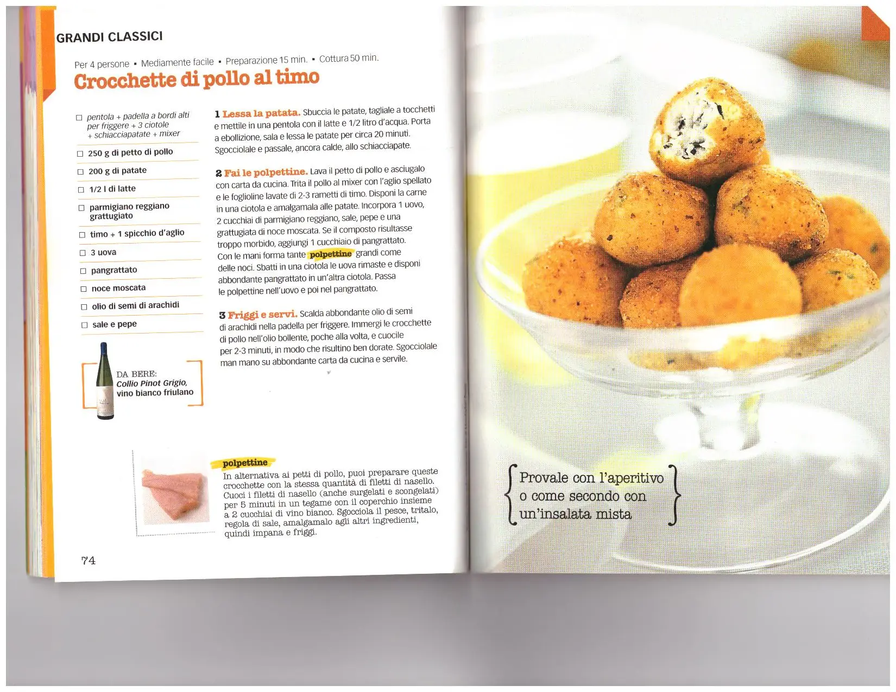

## Ingredienti

| Ingredienti                  | Ingredienti             |
| ---------------------------- | ----------------------- |
| **250 g** - Petto di pollo | **200 g** - patate |
| **1/2 l** - Latte | **2 cucchiai** Parmigiano tritato |
| **1 spicchio** - Aglio | Timo |
| **3** - Uova | Pane grattato |
| Noce moscata | Olio di semi |
| Sale e pepe | |

## Procedimento

1. **Lessa la patata**. Sbuccia le patate, tagliale a tocchetti e mettile in una pentola con il latte e 1/2 litro d'acqua. Porta a ebollizione, sala e lessa le patate per circa 20 minuti.
2. Sgocciolale e passale, ancora calde, allo schiacciapate.
3. **Fai le polpettine**. Lava il petto di pollo e asciugalo con carta da cucina. 
4. Trita il pollo al mixer con l'aglio spellato e le foglioline lavate di 2-3 rametti di timo. 
5. Disponi la carne in una ciotola e amalgamala alle patate. 
6. Incorpora 1 uovo, 2 cucchiai di parmigiano reggiano, sale, pepe e una grattugiata di noce moscata. 
7. Se il composto risultasse troppo morbido, aggiungi 1 cucchiaio di pangrattato.
8. Con le mani forma tante polpettine grandi come delle noci. 
9. Sbatti in una ciotola le uova rimaste e disponi abbondante pangrattato in un'altra ciotola. 
10. Passa le polpettine nell'uovo e poi nel pangrattato.
11. **Friggi e servi**. Scalda abbondante olio di semi di arachidi nella padella per friggere. 
12. Immergi le crocchette di pollo nell'olio bollente, poche alla volta, e cuocile per 2-3 minuti, in modo che risultino ben dorate. 
13. Sgocciolale man mano su abbondante carta da cucina e servile.

## Note

- In alternativa ai petti di pollo, puoi preparare queste crocchette con la stessa quantità di filetti di nasello. Cuoci i filetti di nasello (anche surgelati e scongelati) per 5 minuti in un tegame con il coperchio insieme a 2 cucchiai di vino bianco. Sgocciola il pesce, tritalo, regola di sale, amalgamalo agli altri ingredienti, quindi impana e friggi.