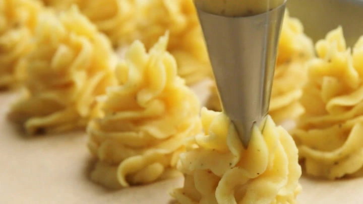

---
tags:
  - Patate
---
# Duchess Potatoes

## Ingredienti

| Ingredienti                  | Ingredienti             |
| ---------------------------- | ----------------------- |
| **2 pounds** - Potatoes | **3** - Egg yolks |
| Salt | **$\frac{1}{2}$ tsp** - Black pepper |
| **$\frac{1}{4}$ cup** - Heavy cream | **$\frac{1}{4}$ tsp** - Nutmeg |
| **4 tblspn** - Unsalted butter |  |

## Procedimento

> Preheat the oven to 220°

1. Place potatoes in a medium to large (3 quart) pot and cover with a couple inches of cold water. Add a couple teaspoons of salt to the water. Bring to a simmer and cook until the potatoes are fork tender, about 20 to 25 minutes.
1. While the potatoes are boiling, melt 2 tablespoons of butter and set aside. You will use this butter to coat the potatoes right before they go in the oven.
1. When the potatoes are cooked, drain in a colander. Put the potatoes back in the pot and set over low heat. Allow them to release steam for a minute or so.
1. Add 2 tablespoons of butter and mash the potatoes until the butter has been incorporated. Add the nutmeg, black pepper, and heavy cream and continue mashing the potatoes.
1. Once everything is incorporated, add salt to taste. Then, add the egg yolks. Continue to mash until the mixture is smooth. Do not over-mash or your potatoes will end up a gluey consistency.
1. Using a piping bag with a large star point, pipe the potatoes onto a cookie sheet. Alternatively, you can just fill a casserole dish with the mashed potatoes, and use a fork to create lots of peaks on the surface.
1. The swirled edges from the star-point piping bag forms (or the peaks of mashed potatoes in a casserole dish) will brown nicely in the oven. The browned parts taste 
1. great, so you want to maximize them. Whether you make piped portions or a casserole, brush the potatoes with the melted butter.
1. Bake in the 220° oven until nicely browned, about 20 minutes. Serve hot, fresh from the oven.

