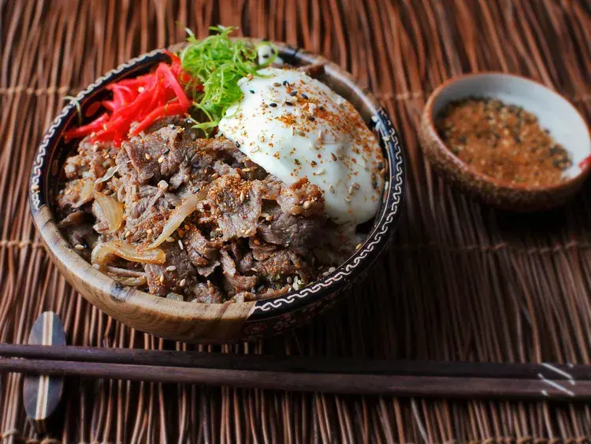

---
tags:
  - Manzo
  - Riso
  - Giapponese
---
# Gyudon (Japanese Simmered Beef and Rice Bowls)

## Ingredienti

### Gyudon

| Ingredienti | Ingredienti |
| --- | --- |
| **1 1/2 tazze (360 ml)** - Dashi (vedi nota) | **1/2 tazza (120 ml)** - Sake |
| **1/3 tazza (80 ml)** - Salsa di soia | **2 cucchiai (25 g)** - Zucchero |
| **1** - Cipolla gialla grande, tagliata a fettine sottili (vedi nota) | **450 g** - Ribeye o chuck a fettine sottilissime (vedi nota) |
| **1 pezzo da 5 cm** - Zenzero, grattugiato | |

### Per servire

| Ingredienti | Ingredienti |
| --- | --- |
| Riso bianco cotto | Beni-shoga (zenzero giapponese in salamoia; opzionale) |
| Cipollotti affettati sottili (opzionale) | Togarashi (peperoncino giapponese in polvere; opzionale) |
| Uova in camicia o crude (opzionale) | |

## Procedimento

1. In una casseruola media, combinare il dashi, il sake, la salsa di soia e lo zucchero. Aggiungere le fettine di cipolla e portare a ebollizione a fuoco medio-alto. Ridurre a un leggero bollore e cuocere fino a quando le cipolle sono morbide, circa 5 minuti.
2. Aggiungere la carne, mescolando per separare le fettine, e cuocere, mescolando di tanto in tanto, fino a quando la carne non è più rosa all'esterno e il liquido si è ridotto fino ad avere una consistenza di salsa, da 3 a 5 minuti. Aggiungere lo zenzero grattugiato e cuocere per 1 minuto ancora.
3. Dividere il riso tra le ciotole individuali. Coprire con la carne, le cipolle e la salsa. Servire con beni-shoga, cipollotti affettati, togarashi e un uovo in camicia o crudo, se desiderato.

## Note

- Per preparare il dashi, combinare 2 tazze (475 ml) di acqua fredda con 7 g di kombu (alga essiccata) in una casseruola media e portare a ebollizione a fuoco medio-alto. Rimuovere il kombu e aggiungere 14 g di katsuobushi (fiocchi di bonito). Spegnere il fuoco e lasciare in infusione per 5 minuti. Filtrare i fiocchi di bonito. In alternativa, usare dashi istantaneo in polvere, come Hondashi, secondo le indicazioni della confezione.
- Per le cipolle, preferire il taglio radiale anziché ad anelli: tagliare le estremità del gambo e della radice, dividere la cipolla a metà da polo a polo, appoggiare ogni metà piatta sul tagliere e affettare da polo a polo verso il centro della cipolla.
- Per la carne, cercare confezioni di carne affettata per Philly cheesesteak se non si trova carne affettata in stile giapponese. In alternativa, congelare parzialmente una bistecca di chuck fino a quando è molto soda e affettarla il più sottilmente possibile.

## Origine

[Gyudon (Japanese Simmered Beef and Rice Bowls) - Serious Eats](https://www.seriouseats.com/gyudon-japanese-simmered-beef-and-rice-bowl-recipe)
