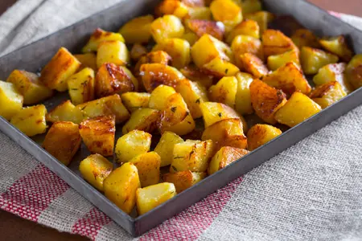

---
tags:
  - Patate
  - Al forno
---
# Patate al forno

## Ingredienti

| Ingredienti | Ingredienti |
| --- | --- |
| **1 kg** - Patate a pasta gialla | **2 rametti** - Rosmarino |
| **2 spicchi** - Aglio | **30 g** - Olio extravergine d'oliva |
| **q.b.** - Sale fino | **q.b.** - Pepe nero |
| **2 rametti** - Timo | **q.b.** - Olio extravergine d'oliva (per ungere la teglia) |

## Procedimento

> Preriscaldare il forno ventilato a 220°

1. Lavare bene le patate e sbucciarle.
2. Dividere le patate a metà per il senso della lunghezza, poi in quarti.
3. Ricavare cubetti di circa 2 cm e trasferirli in una ciotola.
4. Portare ad ebollizione abbondante acqua in una pentola e immergere le patate.
5. Sbollentarle per 7 minuti, quindi scolarle e trasferirle in una ciotola.
6. Aromatizzare con le foglioline di timo.
7. Aggiungere sale, pepe e olio; mescolare bene con un cucchiaio.
8. Trasferire le patate in una teglia unta dai bordi bassi.
9. Aggiungere rametti di rosmarino e spicchi d'aglio.
10. Cuocere per 40 minuti fino a doratura. A metà cottura, mescolare delicatamente le patate.
11. Sfornare, togliere gli spicchi d'aglio e servire.

## Note

- Conservazione: max 2 giorni in contenitore ermetico in frigorifero.

## Origine

[Patate al forno - Giallo Zafferano](https://ricette.giallozafferano.it/Patate-al-forno.html)
