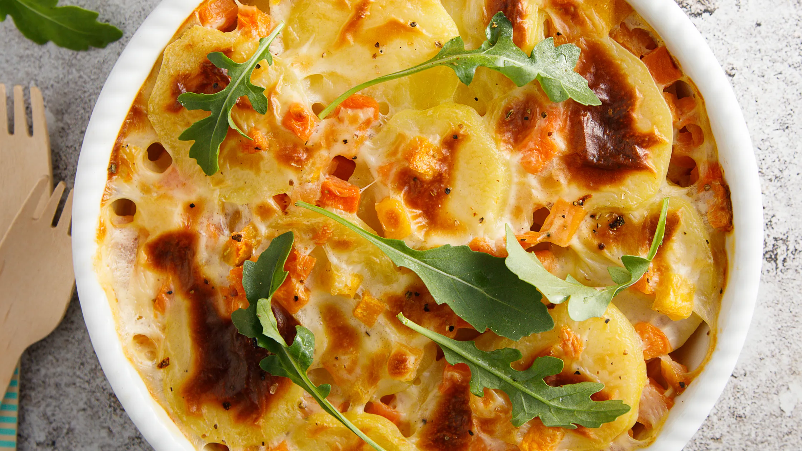

---
tags:
  - Zucca
  - Patate
---

## Ingredienti

| Ingredienti                  | Ingredienti             |
| ---------------------------- | ----------------------- |
| **500 g** - Patate | **400 g** - Zucca |
| **150 g** - Parmigiano grattugiato | **80 g** - Pangrattato |
| **50 g** - Burro | **2 cucchiai** - Olio evo |
| Sale e pepe | Noce moscata |

## Procedimento

1. Sbucciate le patate e tagliatele a fette sottili, fate lo stesso con la zucca.
2. Ungete una teglia con un filo d’olio, disponete a strati patate e zucca alternandole e condendo ogni strato con formaggio grattugiato, pangrattato, sale, pepe e una spolverata di noce moscata.
3. Proseguite fino ad esaurire gli ingredienti, terminate con abbondante pangrattato e formaggio, aggiungete i fiocchetti di burro e infornate a 180° per circa 40 minuti fino a doratura.
4. Servite caldo, con la crosticina ben croccante.
