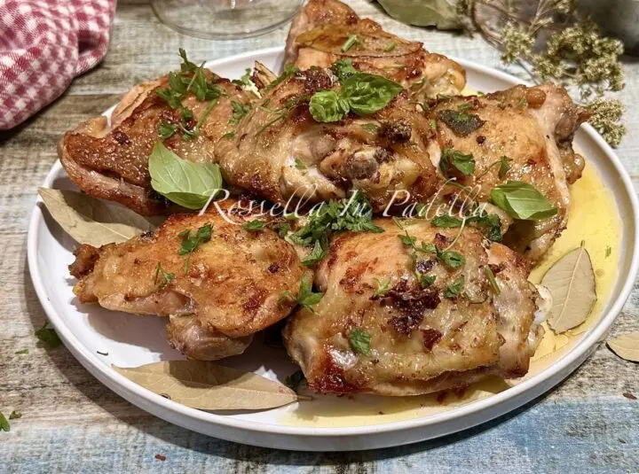

---
tags:
  - Pollo
  - Birra
---
# Pollo alla birra

## Ingredienti

| Ingredienti | Ingredienti |
| --- | --- |
| **1 kg** - Pollo (in parti: cosce, petto, ali) | **600 ml** - Birra chiara |
| **q.b.** - Aromi per arrosto (salvia, alloro, rosmarino, origano secco) | **2 spicchi** - Aglio |
| **q.b.** - Olio extravergine d'oliva | **q.b.** - Sale |
| **q.b.** - Pepe | |

## Procedimento

1. In una ciotola capiente, mettere il pollo, salare, bagnare con un filo d'olio, unire gli aromi e l'aglio, massaggiare e lasciare riposare per circa mezz'ora.
2. Scaldare una padella con poco olio, aggiungere il pollo e farlo rosolare bene da entrambi i lati girandolo più volte, per circa 10 minuti.
3. Quando sarà ben dorato, alzare la fiamma e sfumare con la birra. Lasciare cuocere senza coperchio per circa 5 minuti.
4. Coprire con coperchio e fare continuare la cottura a fiamma bassa girandolo di tanto in tanto.
5. A fine cottura, aggiustare di sale e pepe, completare con origano secco e/o prezzemolo fresco tritato e servire con il sughetto.

## Note

- Aggiunte possibili: funghi champignon, pancetta o speck, senape o miele.
- La birra può essere sostituita con vino bianco, brodo di pollo/vegetale o aceto di mele.

## Origine

[Pollo alla birra - Rossella in Padella](https://blog.giallozafferano.it/rossellainpadella/ricetta-pollo-birra/)
