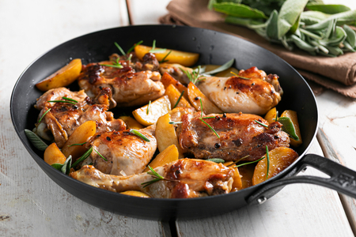

## Ingredienti

| Ingredienti                  | Ingredienti             |
| ---------------------------- | ----------------------- |
| **650 g** - Sovracosce di pollo | **550 g** - Cosce di pollo |
| **500 g** - Patate novelle | **2 spicchi** - Aglio |
| **150 g** - Vino bianco | **150 g** - Acqua calda |
| Salvia | Rosmarino |
| **20 g** - Olio evo | Sale e pepe |

## Procedimento

1. Per preparare il pollo e patate in padella, fate insaporire l'olio con gli spicchi d'aglio in un'ampia padella antiaderente. 
2. Dopo un paio di minuti aggiungete le cosce e sovracosce di pollo con la pelle rivolta verso il basso. Salate, pepate e rosolate a fuoco medio-alto per 5 minuti, poi coprite con il coperchio e cuocete per circa 8-10 minuti.
3. Nel frattempo lavate e tagliate le patate novelle a spicchi, senza eliminare la buccia. 
4. Verificate che il pollo sia ben dorato sotto, poi giratelo, eliminate l'aglio e rosolate ancora per circa 5 minuti, sempre a fuoco medio-alto. 
5. Quando il pollo sarà dorato da entrambe le parti, sfumate con il vino bianco e lasciate evaporare la parte alcolica. 
6. Abbassate leggermente la fiamma e cuocete per altri 6 minuti.
7. A questo punto togliete il pollo dalla padella e conservatelo in una teglia coperto con pellicola; in questo modo rimarrà tenero. 
8. Aggiungete le patate nella stessa padella con il fondo di cottura del pollo e salate.
9. Aromatizzate con i rametti di rosmarino e salvia e rosolate le patate a fuoco medio per 7-8 minuti. Trascorso questo tempo, rimettete le cosce e sovracosce di pollo nella padella e bagnate con l'acqua calda.
10. Coprite con il coperchio e proseguite la cottura a fuoco medio-basso per altri 20 minuti. 
11. Infine, togliete il coperchio e lasciate asciugare per 5 minuti il fondo di cottura. 
12. Questo è il momento giusto per regolare di sale o controllare la cottura del pollo.
