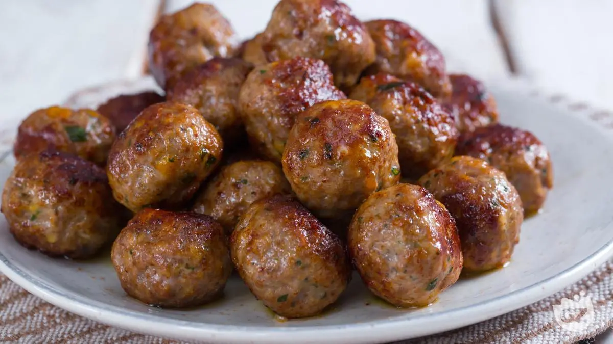

---
tags:
  - Carne
  - Manzo
  - Maiale
  - Polpette
---
# Polpette di carne

## Ingredienti

| Ingredienti | Ingredienti |
| --- | --- |
| **350 g** - Manzo macinato | **150 g** - Maiale macinato |
| **60 g** - Pane mollica grattugiata | **80 g** - Parmigiano Reggiano DOP da grattugiare |
| **1** - Uovo medio | **1 ciuffo** - Prezzemolo |
| Sale fino q.b. | Pepe nero q.b. |
| Olio extravergine d'oliva per friggere | |

## Procedimento

1. Unite in una ciotola la carne trita di manzo e maiale, l'uovo, la mollica di pane fresco frullata, il Parmigiano Reggiano DOP grattugiato e il prezzemolo tritato.
2. Insaporite con sale e pepe.
3. Amalgamate bene tutti gli ingredienti e impastate energicamente.
4. Fate riposare 30 minuti l'impasto coperto in frigo.
5. Prelevate 25 g di composto e dategli forma tonda con le mani umide.
6. Appoggiate le polpette su un vassoio.
7. Scaldate circa un dito d'olio in una padella antiaderente.
8. Immergete le polpette nell'olio caldo.
9. Rosolate su tutti i lati per circa 6-7 minuti.
10. Coprite con coperchio e cuocete per altri 3 minuti.

## Note

- Potete insaporire con peperoncino fresco, erbe e spezie preferite.
- Possibile aggiungere uno spicchio d'aglio grattugiato.
- Conservabile in frigo per 2 giorni in contenitore ermetico.
- Congelabile dopo raffreddamento completo.
- L'impasto si conserva in frigo max 24 ore.

## Origine

[Polpette di carne - Giallo Zafferano](https://ricette.giallozafferano.it/Polpette-di-carne.html)
