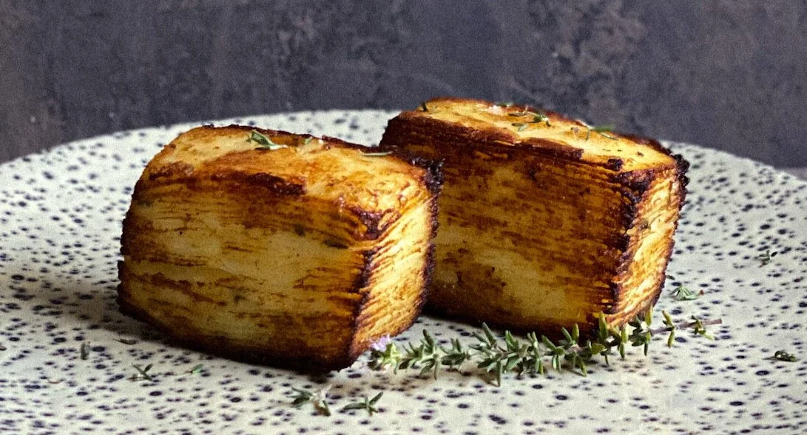

---
tags:
  - Patate
---
# Potato Pavé

## Ingredienti

| Ingredienti                  | Ingredienti             |
| ---------------------------- | ----------------------- |
| **3** - Patate giale medie | Timo |
| **125 ml** - Panna | **$\frac{1}{2}$ spicchio** - Aglio |
| Sale | Burro |
| Pepe | Olio evo (o burro) per rosolare |

## Procedimento

> Preriscaldare il forno a 170° ventilato

1. Peliamo le patate, laviamole con cura e con una mandolina affettiamole il più finemente possibile.
1. In una boule versiamo la panna che andremo ad aromatizzare con l'aglio schiacciato, il timo, sale e pepe. Immergiamo le patate nella panna, facendo attenzione a bagnarle per bene.
1. Inseriamo due fogli di carta forno all'interno del nostro stampo, di modo che i bordi fuoriescano (verranno utilizzati per “chiudere” lo stampo).
1. Procediamo così con le patate bagnate di panna: formiamo un primo strato, aggiungiamo sopra qualche ciuffo di burro e un cucchiaio raso di panna (la stessa in cui sono immerse le patate), procediamo quindi con il secondo strato, burro, panna e via con il terzo, proseguendo così fino ad arrivare a riempire lo stampo.
1. Versiamo la restante panna in superficie e poi richiudiamo i lembi della carta forno a coprire tutte le patate. Adesso ripieghiamo un foglio di alluminio affinché sia della stessa dimensione del perimetro dello stampo, adagiamolo come fosse un coperchio e inforniamo tutto per 50 minuti.
1. Se si utilizza un stampo più grande i tempi si allungano, ma possiamo capire se le patate sono pronte o meno, inserendo uno stecchino all'interno e controllando che entri senza sforzi, altrimenti continuiamo la cottura in forno.
1. Una volta pronte, sforniamo e lasciamo intiepidire.
1. Ora bisogna "pressare" la patate: io ho usato due scatolette di latta delle conserve, ma va bene qualsiasi cosa si adegui alla forma dello stampo e faccia da peso.
1. Lasciamo in frigorifero a rassodare e pressare per 24 ore.
1. Sformiamo il nostro pavé, facendo attenzione a staccarlo dalle pareti con l'aiuto di un coltello e sollevandolo con la carta forno.
1. Una volta eliminata la carta, ritagliamo le parti diagonali dovute allo stampo, ricavando un rettangolo perfetto che taglieremo per la larghezza in piccoli rettangoli tutti uguali.
1. Per finire, in un pentolino facciamo sciogliere due noci di burro con un goccio di olio (va bene anche solo olio), aggiungiamo un rametto di timo (anche mezzo spicchio di aglio se ci piace) e facciamo scaldare. Rosoliamo su tutti e 4 i lati i nostri pavé, finché non saranno bene dorati!
1. Facciamo scolare su carta assorbente.
2. Serviamo con del sale in scaglie e timo fresco, oppure in accompagnamento a carni o pesce di qualsiasi tipo!