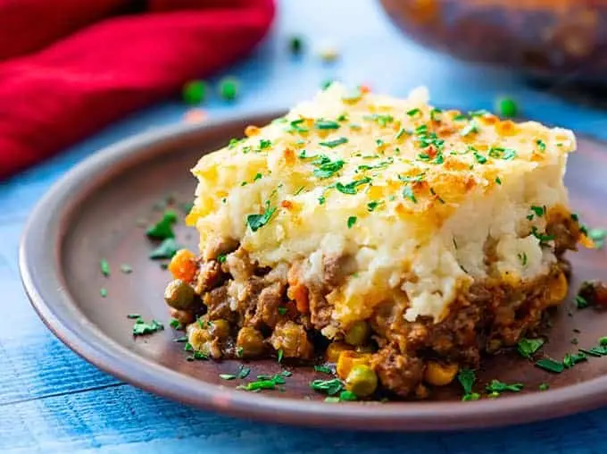

[Sorgente](https://www.thewholesomedish.com/the-best-classic-shepherds-pie/)

## Ingredienti

### Meat filling

| Ingredienti                  | Ingredienti             |
| ---------------------------- | ----------------------- |
| **2 tbsp** - Olive oil | **1 cup** - Chopped yellow onion |
| **1 lb** - 90% lean ground beef (or lamb) | **2 teasp** - Dried parsley leaved |
| **1 teasp** - Dried rosemary leaves | **1 teasp** - Dried thyme leaves |
| **$\frac{1}{2}$ teasp** - Salt | **$\frac{1}{2}$ teasp** - Ground black pepper |
| **1 tbsp** - Worcestershire sauce | **2** - Garlic cloves (minced) |
| **2 tbsp** - Flour | **2 tbsp** - Tomato paste |
| **1 cup** - Beef broth | **1 cup** - Frozen peas and carrots |
| **$\frac{1}{2}$ cup** - Frozen corn kernels |  |

### Mashed potatoes

| Ingredienti                  | Ingredienti             |
| ---------------------------- | ----------------------- |
| **$1\frac{1}{2}-2$ lb** - Russet potatoes (2 large) | **8 tbsp** - Unsalted butter |
| **$\frac{1}{3}$ cup** - Half & half | **$\frac{1}{2}$ teasp** - garlic powder |
| **$\frac{1}{2}$ teasp** - Salt | **$\frac{1}{4}$ teasp** - Ground black pepper |
| **$\frac{1}{4}$ cup** - Parmigiano | |

## Procedimento

> Preheat oven to 200 degrees C

### Filling

1. Add the oil to a large skillet and place it over medium-high heat for 2 minutes. Add the onions. Cook 5 minutes, stirring occasionally.
2. Add the ground beef (or ground lamb) to the skillet and break it apart with a wooden spoon. 
3. Add the parsley, rosemary, thyme, salt, and and pepper. 
4. Stir well. Cook for 6-8 minutes, until the meat is browned, stirring occasionally.
5. Add the Worcestershire sauce and garlic. Stir to combine. Cook for 1 minute.
6. Add the flour and tomato paste. Stir until well incorporated and no clumps of tomato paste remain.
7. Add the broth, frozen peas and carrots, and frozen corn. Bring the liquid to a boil then reduce to simmer.
8. Simmer for 5 minutes, stirring occasionally.
9. Set the meat mixture aside. Preheat oven to 400 degrees F.

### Potatoes

10. Peel the potatoes and cut in pieces of about 1 inch thickness
11. Place the potatoes in a large pot. Cover the potatoes with water. Bring the water to a boil. Reduce to a simmer. 
12. Cook until potatoes are fork tender, 10-15 minutes.
13. Drain the potatoes in a colander. Return the potatoes to the hot pot. Let the potatoes rest in the hot pot for 1 minute to evaporate any remaining liquid.
14. Add butter, half & half, garlic powder, salt, and pepper. 
15. Mash the potatoes and stir until all the ingredients are mixed together.
16. Add the parmesan cheese to the potatoes. Stir until well combined.

### Assemble

17. Pour the meat mixture into a 9x9 (or 7x11) inch baking dish. 
18. Spread it out into an even layer. 
19. Spoon the mashed potatoes on top of the meat. Carefully spread into an even layer.
20. If the baking dish looks very full, place it on a rimmed baking sheet so that the filling doesn’t bubble over into your oven. 
21. Bake uncovered for 25-30 minutes.
22. Cool for 15 minutes before serving.
