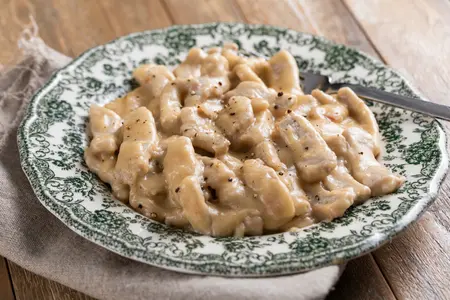

---
tags:
  - Maiale
  - Birra
---
# Straccetti di maiale alla birra

## Ingredienti

| Ingredienti | Ingredienti |
| --- | --- |
| **500 g** - Lonza di maiale | **200 g** - Birra chiara |
| **1 spicchio** - Aglio | **1 rametto** - Rosmarino |
| **100 g** - Farina 00 | Olio extravergine d'oliva q.b. |
| Sale fino q.b. | |

## Procedimento

1. Tagliate la lonza a fette, poi ricavate delle striscette e proseguite in modo da ricavare degli straccetti.
2. In un tegame versate l'olio extravergine d'oliva, il rosmarino e l'aglio. Lasciate insaporire a fuoco dolce.
3. Versate la farina in una ciotola e aggiungete gli straccetti di maiale, mescolate per infarinarli bene.
4. Togliete aglio e rosmarino dalla pentola.
5. Eliminate l'eccesso di farina dagli straccetti e trasferiteli nel tegame.
6. Salate e rosolate per bene.
7. Sfumate con la birra.
8. Cuocete per circa 13 minuti, fino a che il fondo non si sarà addensato.
9. Impiattate, aggiungete una grattata di pepe nero e servite.

## Note

- Potete aggiungere cipolla rossa a rondelle o scalogno e carota tagliata a julienne, soffritti dolcemente insieme all'aglio.
- Conservazione: in frigo per 2 giorni ben coperti.

## Origine

[Straccetti di maiale alla birra - Giallo Zafferano](https://ricette.giallozafferano.it/Straccetti-di-maiale-alla-birra.html)
