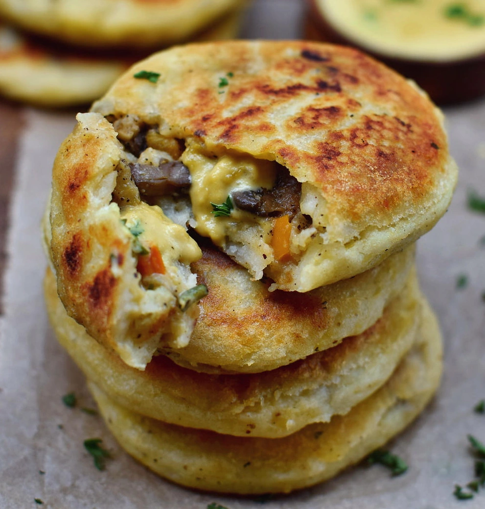

---
tags:
  - Patate
  - Funghi
---
# Stuffed potato cakes

## Ingredienti

**Impasto**

| Ingredienti                  | Ingredienti             |
| ---------------------------- | ----------------------- |
| **1 kg** - Potatoes | Nutmeg |
| **80 g** - White rice flour | Salt and pepper |
| **40 g** - Cornstarch or tapioca flour | |

**Ripieno**

| Ingredienti                  | Ingredienti             |
| ---------------------------- | ----------------------- |
| **250 g** - Mushrooms, sliced | **1 tsp** - Italian spice blend |
| **$\frac{1}{2}$** - Zucchini, diced | **1 tsp** - Onion powder |
| **1** - Onion, chopped | **1 tsp** - Garlic powder |
| **1** - Bell pepper, diced | **$\frac{1}{2}$ tsp** - Cumin |
| **1 clove** - Garlic | **$\frac{1}{4}$** - Red pepper flakes |
| Salt and pepper | |

## Procedimento

### Dough

1. Peel potatoes, cut into small pieces and cook in salted water for about 20 minutes.
1. Season with salt, pepper, and nutmeg and mash them with a potato masher. (Please do not use a food processor, otherwise, the mashed potatoes will be sticky).
1. Allow the mashed potatoes to cool (in the meantime you can prepare the filling), then add flour and cornstarch and mix well with a spoon or your hands.

### Filling

> Preheat the oven to 190°

1. Chop the veggies into small pieces, fry the onion in a pan with a little oil for about 3-4 minutes, add the mushrooms, garlic, and also the diced peppers and the zucchini. Sauté everything for a couple of minutes, season with salt, pepper, and the spice mix.
1. Split the dough into 8 parts (about 1/2 cup or 120 g each). Form into balls, make a well in the middle and add about one and a half tablespoons of the filling. You can also add some vegan cheese (I used vegan cheese sauce) in addition. Carefully "seal" the balls with more dough and flatten them slightly to make them look like thick pancakes.
1. Heat approximately 2 tablespoons of oil in a pan and fry the potato cakes at medium heat until golden brown on both sides. They will be crunchy on the outside and soft on the inside. If you want them to be slightly more crunchy, you can bake them additionally for about 20 minutes at 375 degrees Fahrenheit (190°) in the oven. Enjoy!

## Notes

- Wheat flour or spelt flour might work as well but you will most likely need less. I never tried it, so please experiment at your own risk.
- If the potatoes are extremely floury I would recommend using less rice flour, e.g. just 1/4 cup. The dough shouldn't be too dry or crumbly.
- Recipe makes about 8 potato cakes. Nutrition facts are for one potato cake.

