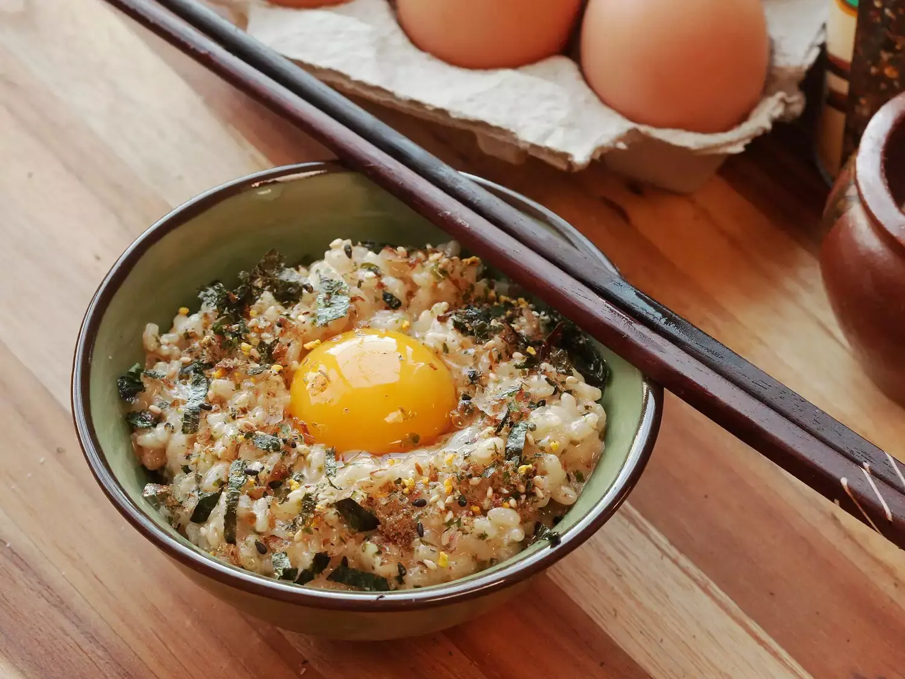

---
tags:
  - Riso
  - Uova
  - Giapponese
---
# Tamago Kake Gohan

## Ingredienti

| Ingredienti | Ingredienti |
| --- | --- |
| **1 tazza** - Riso cotto | **1** - Uovo |
| Salsa di soia | Sale |
| MSG (Aji-no-moto) | Furikake |
| Nori tagliato a striscioline | **1** - Tuorlo d'uovo extra (opzionale) |

## Procedimento

1. Mettere il riso caldo in una ciotola. Se si usa riso avanzato dal frigo, coprire con un piattino e scaldare al microonde per un minuto.
2. Fare un piccolo incavo al centro del riso.
3. Rompere l'uovo direttamente nel riso.
4. Condire con un filo di salsa di soia, un pizzico di sale e un pizzico di MSG.
5. Sbattere vigorosamente con le bacchette fino a quando il composto diventa giallo pallido e spumoso, incorporando aria. Il riso deve essere in una sospensione leggera e spumosa, leggermente più densa di un risotto ma molto più leggera.
6. Completare con furikake e, volendo, un tuorlo d'uovo extra.

## Note

- Usare un uovo fresco e pulito, dato che si mangia crudo. Se si preferisce, usare uova pastorizzate.
- Il riso caldo aiuta ad addensare leggermente l'uovo, ma si può usare anche riso a temperatura ambiente o freddo.
- La chiave è sbattere a lungo e vigorosamente: le proteine dell'uovo si allungano e incorporano aria, creando una consistenza cremosa e leggera.
- Opzionale: aggiungere un po' di dashi, Hondashi, mirin, o tsuyu concentrato per soba.

## Origine

[Tamago Kake Gohan - Serious Eats](https://www.seriouseats.com/tamago-kake-gohan-egg-rice-tkg-recipe-breakfast)
