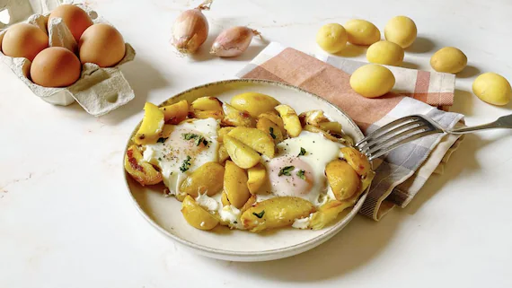

## Ingredienti

| Ingredienti                  | Ingredienti             |
| ---------------------------- | ----------------------- |
| **4** - Uova | **500 g** - Patate novelle |
| **40 g** - Burro chiarificato | **4** - Scalogni |
| Prezzemolo | Sale e pepe |

## Procedimento

1. Raccogli le patate novelle in uno scolapasta e sciacquale per bene sotto l'acqua corrente fredda.
2. Trita grossolanamente gli scalogni e lasciali rosolare in una padella con il burro chiarificato fuso
3. Unisci le patate, tagliate in spicchi
4. Copri con un coperchio e fai cuocere le patate per circa 20 minuti, mescolando spesso 4, fino a quando non saranno dorate e fragranti
5. Con l'aiuto di un mestolo, allarga leggermente le patate in modo da creare quattro cavità
6. Sguscia le uova all'interno di ciascun incavo
7. Copri nuovamente con un coperchio e lascia cuocere le uova per 3 minuti, o fino a quando non si sarà formata una patina bianca e lucida in superficie
8. Al termine, leva dal fuoco, profuma con il prezzemolo sminuzzato e aggiusta di sale e di pepe
