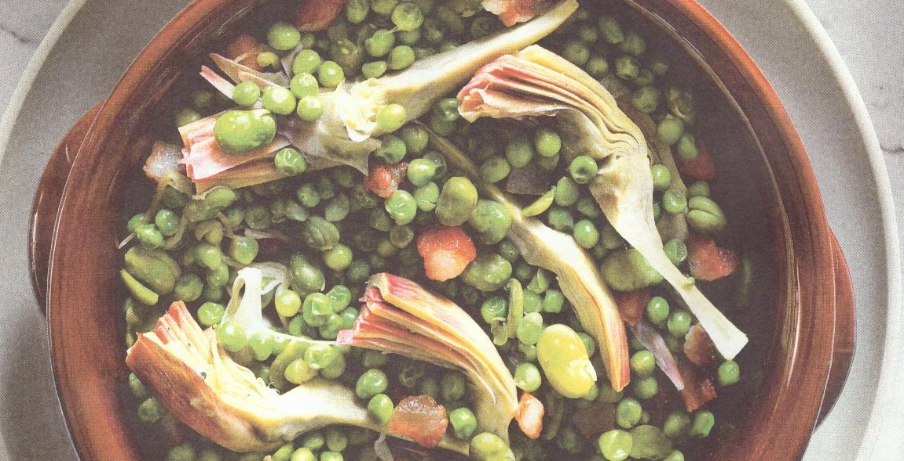

---
tags:
  - Fave
  - Piselli
  - Guanciale
  - Lattuga romana
  - Carciofi
  - Cipolla
---
# Vignarola

## Ingredienti

| Ingredienti                  | Ingredienti             |
| ---------------------------- | ----------------------- |
| **500 g** - Fave fresche | **2** - Cipollotti |
| **500 g** - Pisellini freschi | **1** - Limone |
| **100 g** - Guanciale | Olio evo |
| **1 cespo** - Lattuga romana | Sale e pepe |
| **2** - Carciofi mammole | |

## Procedimento

1. Per preparare la vignarola per prima cosa pulire i carciofi, tagliare il gambo lasciando qualche centimetro ed eliminare le foglie più coriacee.
1. Pelare il gambo, tagliare la punta dei carciofi e dividerli in otto spicchi, eliminando la barbetta e le piccole spine centrali, quindi metterli in una ciotola con acqua e limone in modo che non anneriscano. Tagliare a strisce medie le foglie di lattuga romana, sciacquarla e tenerla da parte lasciandola sgocciolare in un colino.
1. Eliminare la parte verde dei cipollotti e tritarli finemente, poi tagliare il guanciale a cubetti.
1. Una volta pronti tutti gli ingredienti, scaldare un pò d'olio in una casseruola. Quando l'olio è caldo aggiungere i cipollotti e farli appassire.
1. Unire quindi il guanciale tagliato a cubetti e lasciarlo rosolare.
1. Quando inizia a diventare croccante aggiungere le fave, i piselli e i carciofi precedentemente scolati. Regolare di sale e pepe e cuocere per 7-8 minuti. A cottura ultimata spegnere il fuoco e aggiungere la lattuga romana, mescolando per un minuto in modo che appassisca leggermente con il calore. Servire aggiungendo eventualmente qualche foglia di menta.
