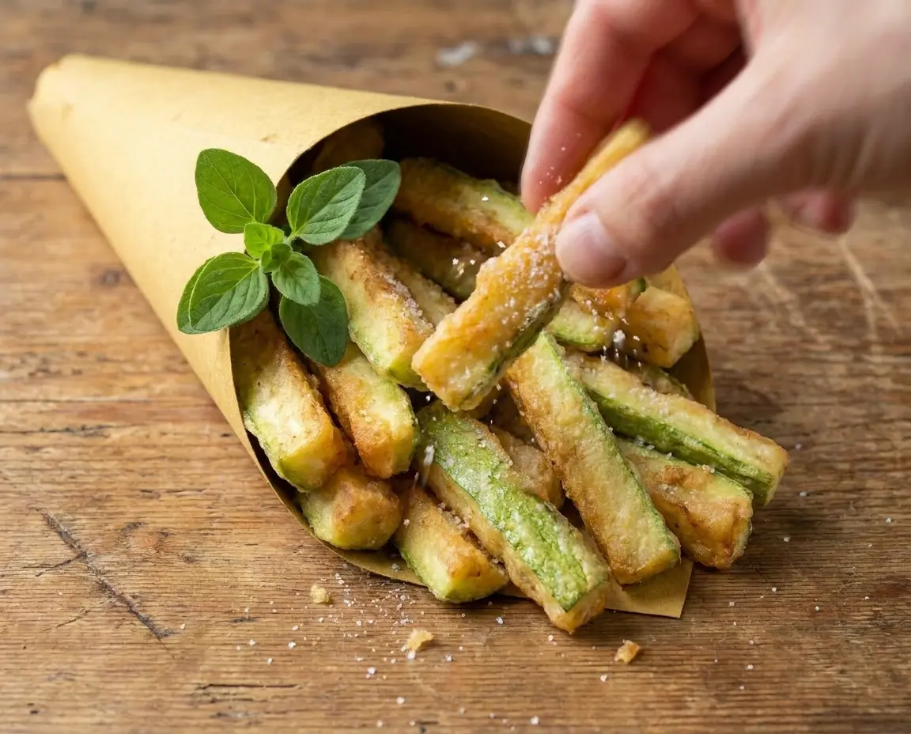

## Ingredienti

| Ingredienti                  | Ingredienti             |
| ---------------------------- | ----------------------- |
| **100 g** - zucchine verdi genovesi| Farina di riso |
| Sale grosso | Olio di semi |
| Sale fino |  |

## Procedimento

1. Lavate le zucchine, asciugatele e tagliatele a bastoncini molto sottili e regolari.
1. Disponetele in uno scolapasta, cospargendole con un po’ di sale grosso.
1. Lasciatele riposare per almeno 30 minuti, meglio ancora 40. Questo passaggio è fondamentale perché permette alle zucchine di perdere parte dell’acqua di vegetazione.
1. Successivamente asciugatele molto bene con carta da cucina o con un canovaccio pulito.
1. Passatele nella farina di riso, eliminando quella in eccesso, scuotendo lo scolapasta.
1. Scaldate abbondante olio fino a circa 170-175°C.
1. Friggete pochi bastoncini per volta, senza riempire troppo la padella. In questo modo la temperatura dell’olio rimarrà costante e i brichetti diventeranno dorati e croccanti.
1. Quando saranno ben coloriti scolateli su carta assorbente.
1. Aggiungete un pizzico di sale soltanto alla fine.
1. Serviteli ben caldi. 

## Origine

[link](https://blog.giallozafferano.it/renatabriano/ricetta-bastoncini-di-zucchine-fritti-cosi-croccanti-che-uno-tira-laltro-i-bricchetti-della-nonna/)

