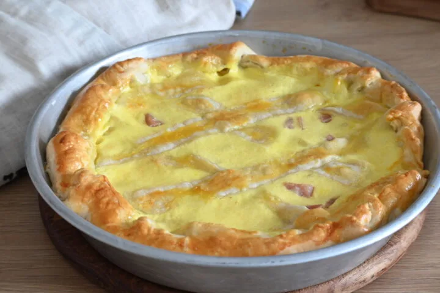

---
tags:
  - Pasta sfoglia
---

## Ingredienti

| Ingredienti                  | Ingredienti             |
| ---------------------------- | ----------------------- |
| **2 rotoli** - Pasta sfoglia (o brisèe) | **200 g** - Prosciutto cotto |
| **200 ml** - Latte | **80 ml** - Panna da cucina |
| **80 g** - Formaggio grattugiato | **2** - Uova |
| Sale | **1** - Uovo (per spennellare) |

## Procedimento

> Preriscaldare il forno a 200°

1. Mettiamo in una ciotola le uova, la panna ed il latte.
2. Mescoliamo tutto ed aggiungiamo il parmigiano ed un pizzico di sale (non troppo).
3. Uniamo il prosciutto cotto tagliato in cubetti oppure in striscioline.
4. Mescoliamo tutto molto bene.
5. Foderiamo con la pasta sfoglia la teglia leggermente imburrata, bucherelliamo il fondo e mettiamo all’interno il ripieno.
6. Prendiamo il resto della pasta sfoglia e formiamo delle strisce larghe 2 cm, sistemiamole sopra la crostata e rifiliamo i bordi.
7. Con l’eccesso possiamo realizzare dei salatini.
8. Inforniamo a 200° per 40 min circa in forno pre riscaldato e statico.
9. Appena la superficie sarà bella dorata sforniamo e serviamo.

## Note

- **Variante vegetariana**: Se preferite, potete sostituire il prosciutto cotto con verdure grigliate come zucchine o melanzane.
- **Formaggi alternativi**: Per un gusto più deciso, provate a sostituire parte della ricotta con del gorgonzola dolce o della fontina.
- **Anticipo**: La crostata al prosciutto cotto può essere preparata in anticipo e riscaldata al momento di servirla. È ottima anche a temperatura ambiente
