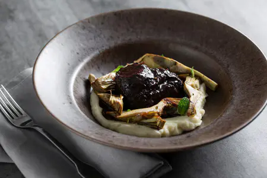
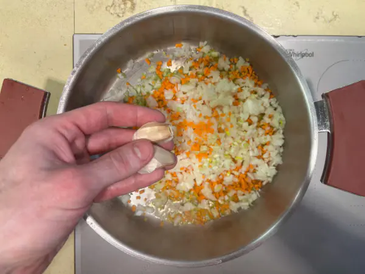
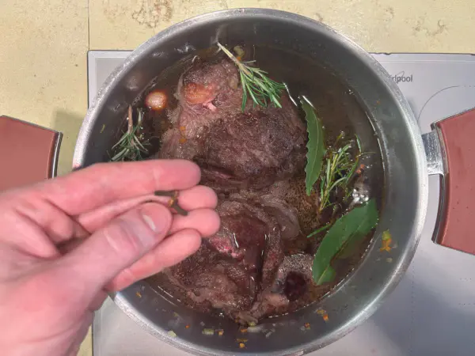
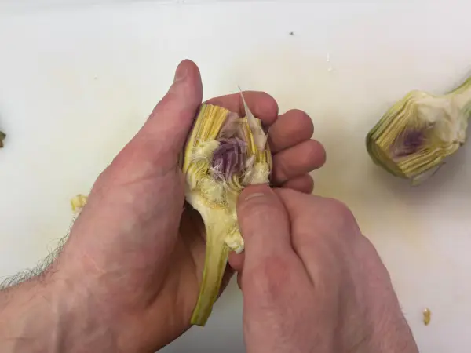

---
tags:
  - Manzo
  - Sedano rapa
---

## Ingredienti

### Carne

| Ingredienti                  | Ingredienti             |
| ---------------------------- | ----------------------- |
| **800 g** - Guancia di manzo | **1** - Cipolla bianca |
| **1** - Carota | **1 costa** - Sedano |
| **2 spicchi** - Aglio | **1,2 l** - Vino rosso |
| **500 g** - Brodo di carne | **3 rametti** - Rosmarino |
| **1 foglia** - Alloro | **1 stecca** - Cannella |
| **2** - Bacche di ginepro | **2** - Chiodi di garofano |
| Olio evo | Sale e pepe |

### Crema di sedano rapa

| Ingredienti                  | Ingredienti             |
| ---------------------------- | ----------------------- |
| **500 g** - Sedano rapa (da pulire) | **20 g** - Olio evo |
| Sale e pepe |  |

### Carciofi in padella

| Ingredienti                  | Ingredienti             |
| ---------------------------- | ----------------------- |
| **4** - Carciofi (da pulire) | Olio evo |
| Sale e pepe | |

## Procedimento

1. Per preparare la guancia di manzo con carciofi come prima cosa realizzate il brodo di carne con la nostra ricetta e tenetelo in caldo. 
2. Pulite la carne eliminando la membrana. 
3. In una pentola versate un filo d’olio, aggiungete la carne e rosolate a fiamma alta, per circa 2 minuti per lato.
4. Rimuovete la carne dalla pentola e pulite il fondo con della carta assorbente, poi versate un bicchiere di vino preso dalla dose totale e deglassate il fondo. Tenete da parte il fondo di cottura.
5. Nella stessa pentola scaldate un altro filo d’olio, poi aggiungete il sedano, la carota e la cipolla tritati finemente. 
6. Unite anche gli spicchi di aglio in camicia e soffriggete a fiamma media per qualche minuto, finché le verdure saranno morbide.
7. Adagiate nuovamente la carne nella pentola, coprite con il vino rimanente (circa un litro) e portate a bollore. 
8. A questo punto aggiungete il rosmarino e l’alloro.
9. Aromatizzate anche con i chiodi di garofano, le bacche di ginepro e, se gradite, una stecca di cannella. 
10. Infine versate il vino tenuto da parte per deglassare il fondo della pentola.
11. Coprite con il brodo caldo, salate e pepate. Aspettate che torni a bollore, poi abbassate la fiamma e cuocete con il coperchio per circa 3 ore.
12. Pulite il sedano rapa e tagliatelo a cubetti, poi cuocetelo in acqua bollente salata per 15-20 minuti. Scolate e trasferite il sedano rapa in un boccale, poi aggiungete l’olio.
13. Regolate di sale e pepe, quindi frullate con un mixer a immersione fino ad ottenere una crema liscia e omogenea. 
14. Trasferitela in un pentolino e tenete in caldo.
15. Ora passate alla pulizia dei carciofi: eliminate le foglie esterne più dure, poi accorciate il gambo e pelatelo cominciando dalla base del carciofo. Tagliate via le punte.
16. Dividete i carciofi a metà ed eliminate la barbetta interna, quindi tagliateli in quarti e immergeteli subito in acqua acidulata.
17. In una padella versate un filo d’olio, aggiungete i carciofi, salate e pepate. 
18. Saltate a fiamma media per circa 6-7 minuti o fino a doratura.
19. Trascorso il tempo di cottura della carne, toglietela dalla pentola e filtrate il fondo di cottura. 
20. Versate nuovamente in pentola la parte liquida e fatela ridurre sul fuoco per una trentina di minuti a fiamma medio-bassa; dovrete ottenere una glassa dalla consistenza abbastanza densa da velare il cucchiaio. 
21. Nel frattempo affettate la carne.
22. Rimettete la carne nella pentola e irrorate con la glassa. 
23. Impiattate distribuendo sul fondo del piatto un letto di crema di sedano rapa, poi adagiate sopra la carne e aggiungete i carciofi tutt'intorno.
24. Nappate la carne con un cucchiaio di glassa e completate con le foglioline di menta fresca.

## Note

- In alternativa alla crema di sedano rapa potete preparare un classico purè di patate o una polenta morbida.
- Se preferite potete sostituire i carciofi con funghi porcini o champignon saltati in padella con aglio e prezzemolo!

## Immagini

