---
tags:
  - Tofu
  - Cappuccio
  - Funghi
---

## Ingredienti

### Impasto

| Ingredienti                  | Ingredienti             |
| ---------------------------- | ----------------------- |
| **220 g** - Farina 00 | **90 g** - Acqua calda |
| Sale | |

### Ripieno

| Ingredienti                  | Ingredienti             |
| ---------------------------- | ----------------------- |
| **100 g** - Cavolo cappuccio | **2** - Funghi orecchioni o ostrica (Pleurotus) medi |
| **3** - Funghi Shiitake piccoli | **2** - Carote medie |
| **1** - Cipollotto fresco | **2 spicchi** - Aglio |
| **60 g** - Zenzero fresco | **40 g** - Salsa di soia |
| **10 g** - Olio di sesamo | **6 g** - Salsa siracha |
| Olio di semi |  |

### Cottura

| Ingredienti                  | Ingredienti             |
| ---------------------------- | ----------------------- |
| **200 g** - Acqua | **10 g** - Olio di sesamo |
| Olio di semi | |

### Accompagnamento

| Ingredienti                  | Ingredienti             |
| ---------------------------- | ----------------------- |
| **50 g** - Salsa di soia | **50 g** - Aceto di riso |

## Procedimento

1. Per prima cosa preparate l’impasto: in una ciotola mescolate la farina con il sale, poi aggiungete l’acqua a filo mentre amalgamate il composto con il cucchiaio.
2. Lavorate l’impasto per qualche minuto prima nella ciotola e poi sul piano di lavoro fino ad ottenere una consistenza liscia e omogenea. 
3. Formate una pallina, avvolgete nella pellicola e lasciate riposare a temperatura ambiente.
4. Nel frattempo occupatevi del ripieno. Mondate e tagliate a pezzetti il cavolo cappuccio, le carote e gli spicchi di aglio privati dell’anima.
5. Fate la stessa cosa con il cipollotto, i funghi e il tofu.
6. In ultimo riducete a pezzetti anche lo zenzero fresco. 
7. Trasferite tutte gli ingredienti in un mixer e frullate per tritarli finemente.
8. Scaldate in una padella un filo d’olio di semi di girasole, poi versate il trito e saltate a fuoco medio per 10 minuti. 
9. Trascorso questo tempo spegnete il fuoco e aggiungete la salsa di soia e l’olio di sesamo. Unite anche la salsa sriracha. 
10. Mescolate bene, poi lasciate raffreddare. 
11. Una volta che il ripieno sarà freddo formate delle palline del peso di circa 10 g l’una e sistematele su un vassoio.
12. Riprendete l’impasto e dividetelo in due parti da cui ricaverete dei filoncini. 
13. Tagliate i filoncini a tocchetti del peso di circa 15 g e formate delle palline.
14. Infarinate leggermente il piano di lavoro e stendete ogni pallina con il mattarello fino allo spessore di 1 mm circa, poi coppate la sfoglia con un coppapasta del diametro di 8 cm. 
15. Sistemate al centro una pallina di ripieno.
16. Piegate il disco a mezzaluna, poi pizzicate uno dei 2 lembi per formare delle piccole pieghe partendo dal centro verso le estremità; per aiutarvi potete spruzzare i bordi della sfoglia con poca acqua. 
17. Man mano che chiudete i gyoza sistemateli su un vassoio leggermente infarinato.
18. Siete pronti per la cottura: scaldate una padella con un giro di olio di semi di girasole, poi adagiate i gyoza e rosolateli a fiamma media senza mai girarli, in modo che si colori solo la parte inferiore; ci vorranno circa 4-5 minuti. 
19. A questo punto versate l’acqua nella padella.
20. Abbassate la fiamma e cuocete con il coperchio per circa 10 minuti; il tempo di cottura varia a seconda dello spessore della pasta. 
21. Una volta cotti, togliete il coperchio, spegnete il fuoco e aggiungete l’olio di sesamo.
22. Versate in una ciotola la salsa di soia e l’aceto di riso, mescolate e servite i vostri gyoza vegetariani con la salsa di accompagnamento!

## Note

- I gyoza vegetariani si possono conservare in frigorifero per un giorno, dopo la cottura.
- Potete congelarli da crudi e cuocerli direttamente da congelati, allungando il tempo di cottura.
- Noi abbiamo scelto di stendere l’impasto molto sottile, ma voi potete decidere di aumentare lo spessore per ottenere una pasta più tenace al morso: in questo caso sarà più facile chiudere i ravioli, ma si allungheranno i tempi di cottura. Tenete conto, inoltre, che la dose dell’impasto sarà sufficiente per un numero minore di pezzi.

## Immagini

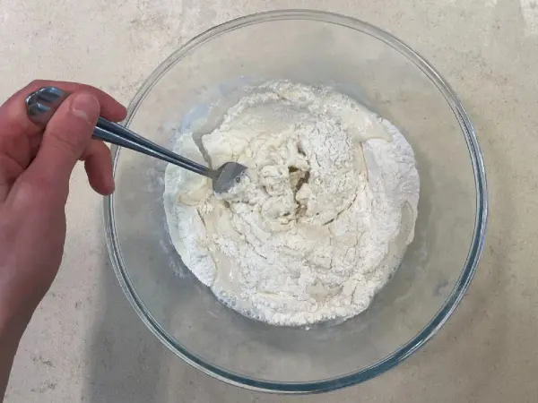

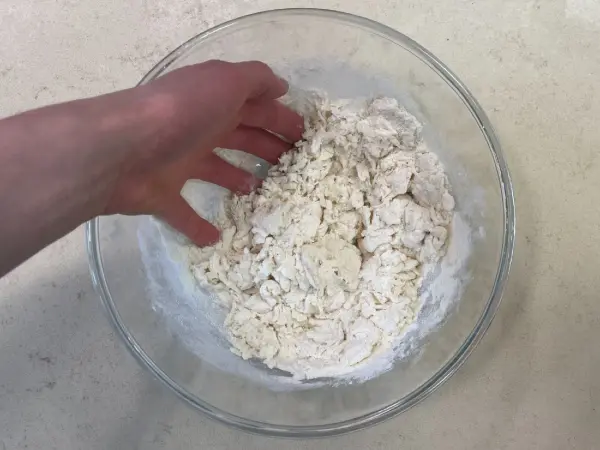

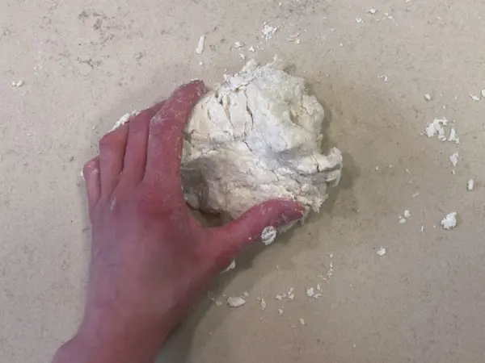

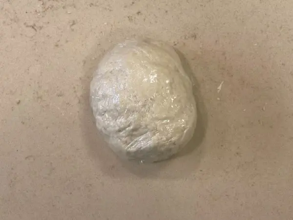

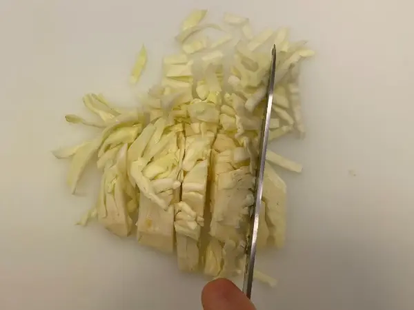

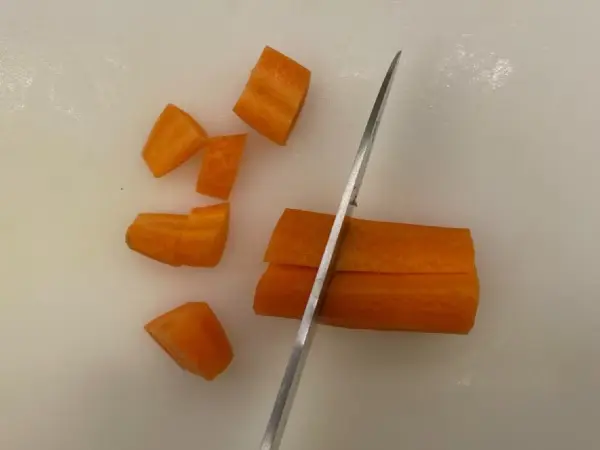

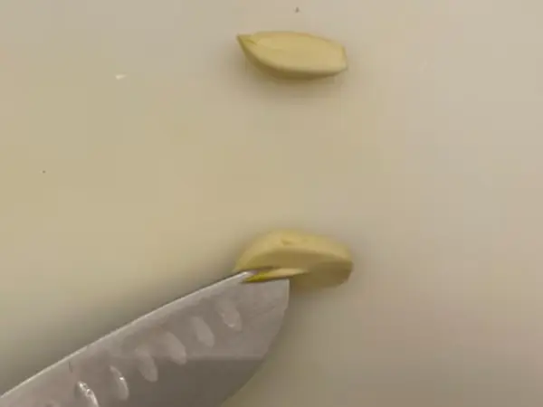

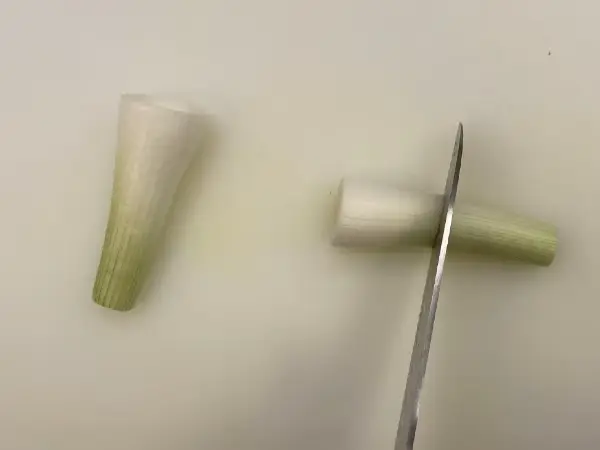

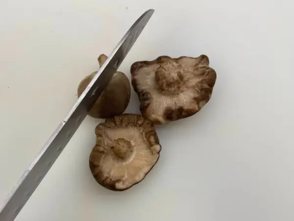

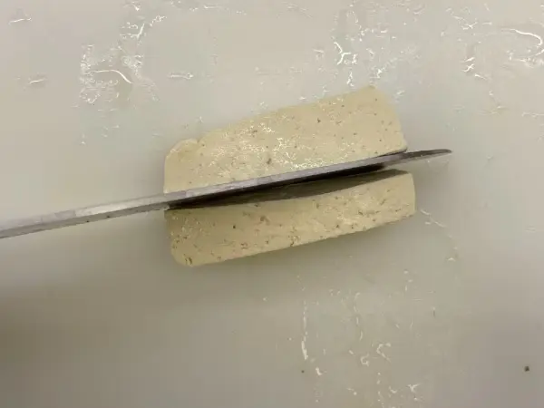

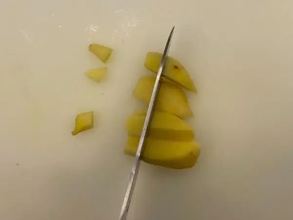

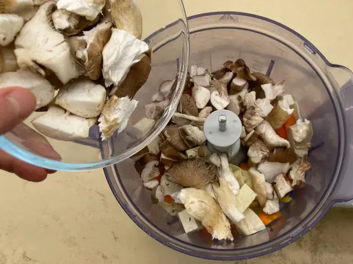

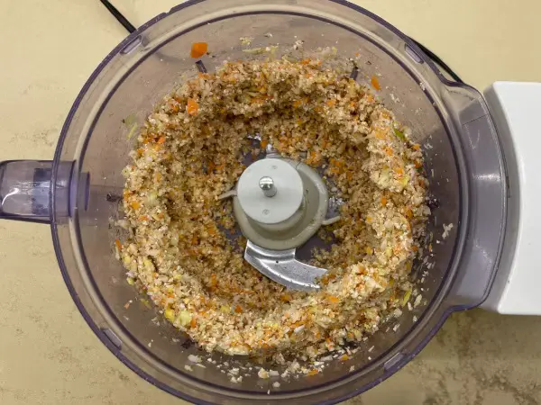

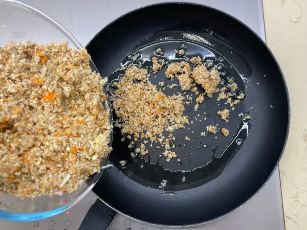

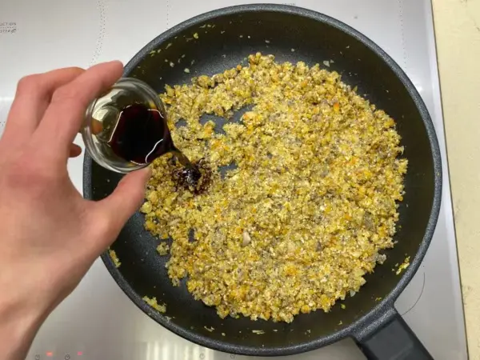

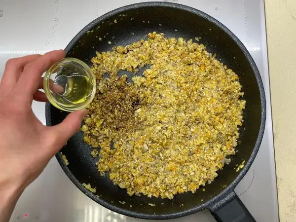

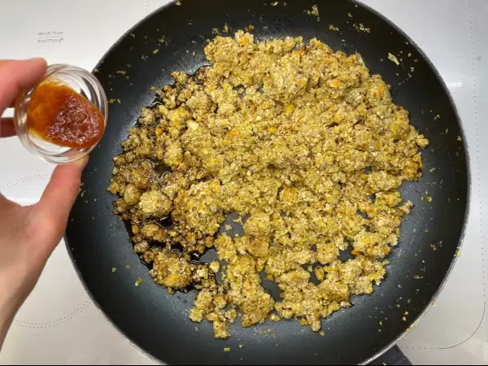

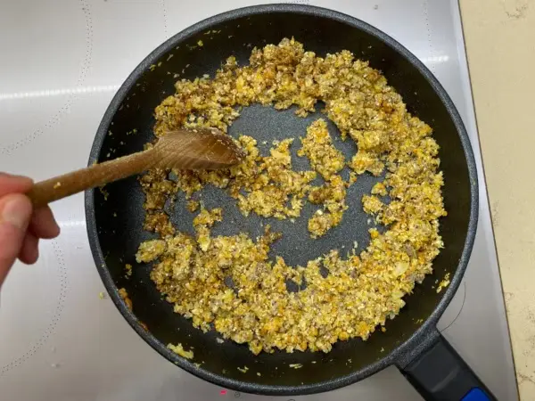

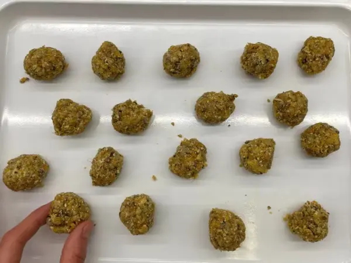

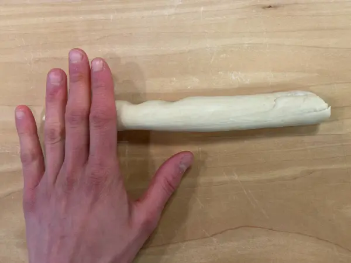

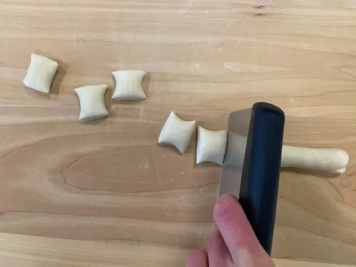

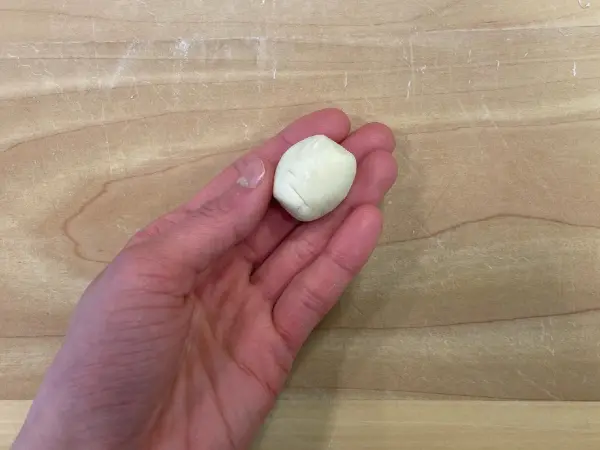

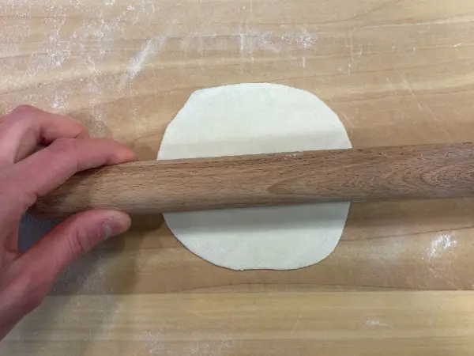

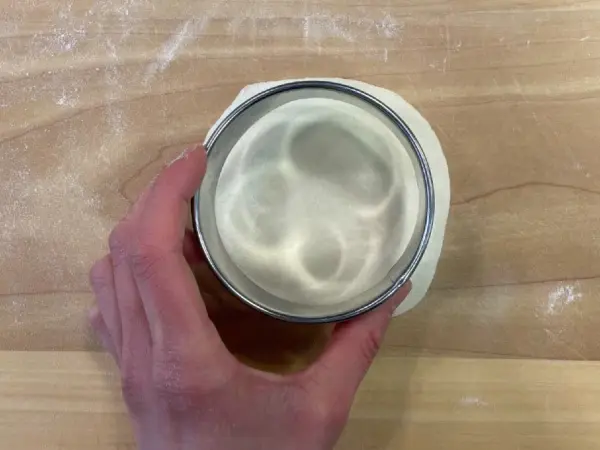

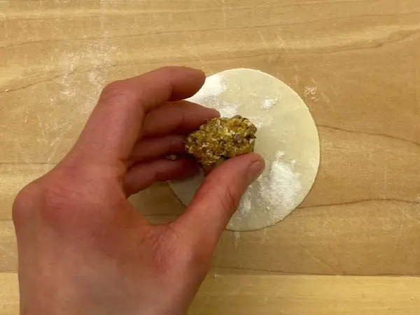

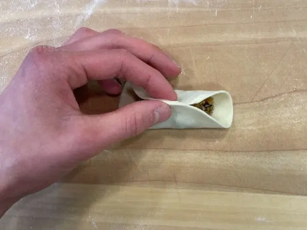

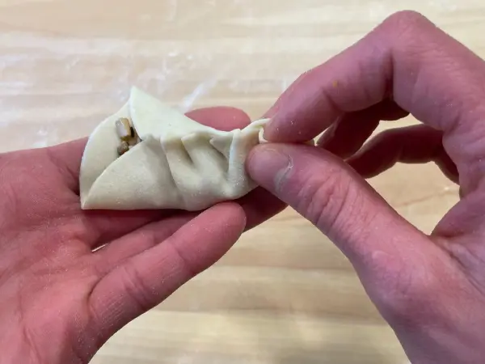

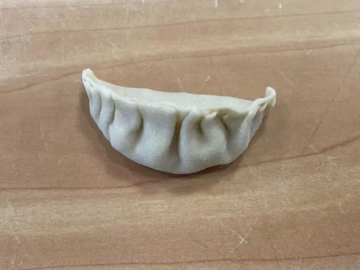

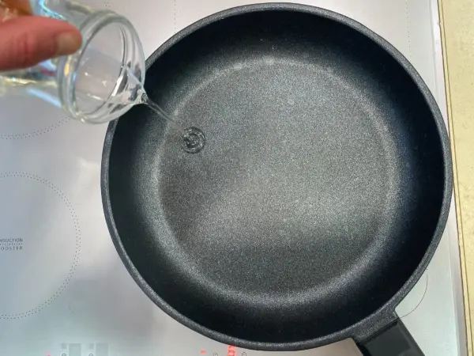

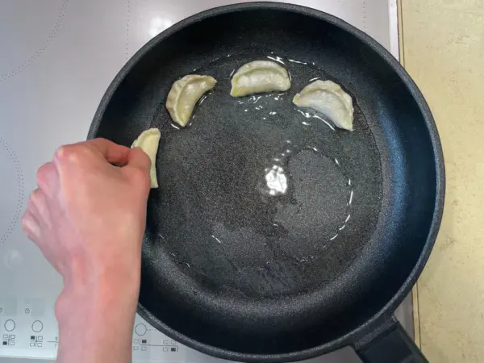

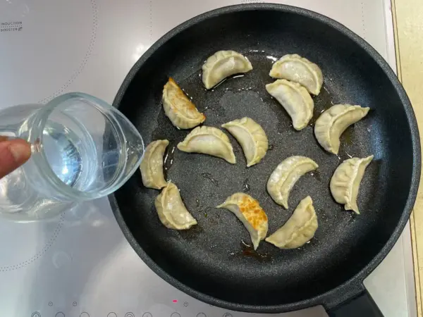

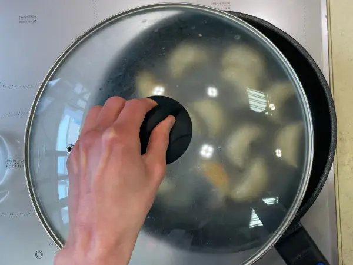

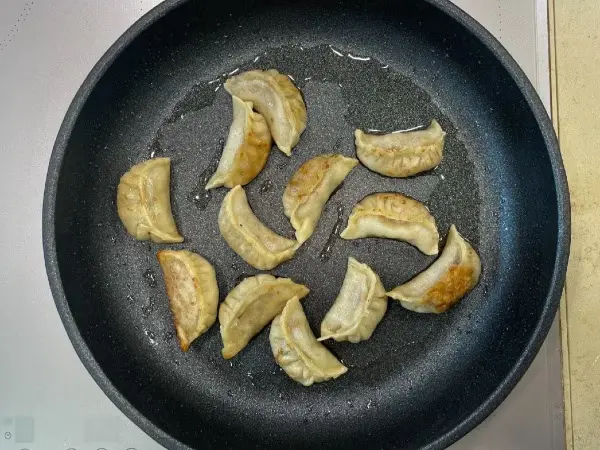

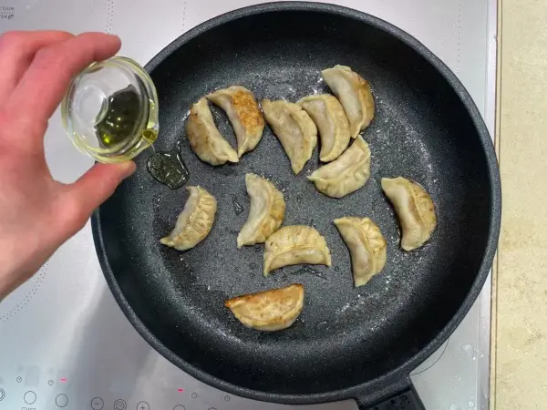

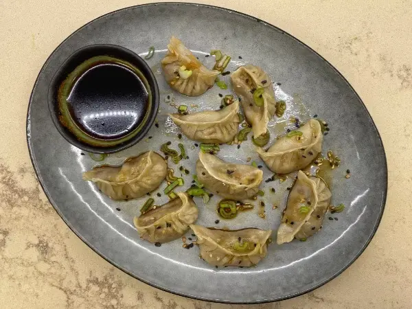
