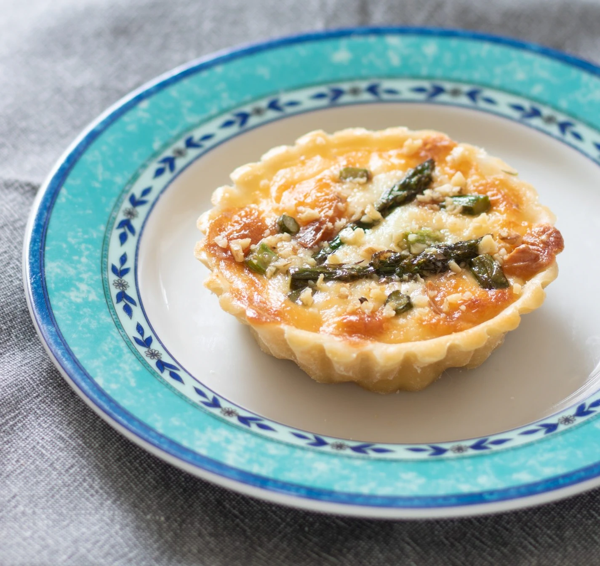

---
tags:
  - Larin
  - Pasta matta
---

[Sorgente](https://dolcimariemonti.it/ricette/tartellette-al-larin/)

## Ingredienti (6 stampi da 10cm)

### Pasta matta

| Ingredienti                  | Ingredienti             |
| ---------------------------- | ----------------------- |
| **125g** Farina 00 | **1 cucchiaio** - Olio evo |
| **1 cucchiaio** - Trentingrana grattuggiato | **70g** - Acqua tiepida |

### Ripieno

| Ingredienti                  | Ingredienti             |
| ---------------------------- | ----------------------- |
| **400g** L'Arin il Fumè di Primiero | **200g** - Asparagi verdi |
| **3/4** - Noci | **1** - Uovo |

## Procedimento

> Preriscaldare il forno a 180° C

1. Setacciate la farina ed unitela al Trentingrana, aggiungete l'olio e l'acqua poco alla volta.
2. Impastate fino ad ottenere una pasta morbida e non appiccicosa.
3. Formate un panetto, cospargetelo con olio o copritelo con della pellicola, lasciate riposare minimo mezz'ora a temperatura ambiente.
4. Lavate e mondate gli asparagi. Tagliateli a pezzettini e cuoceteli in una padella con poca acqua per circa 10 minuti. Scolateli ed asciugateli.
5. Tagliate il L'Arin a dadini piccoli.
6. Tritate finemente le noci.
7. Imburrate ed infarinate gli stampini.
8. Prendete la pasta e ricavate 6 palline di peso uguale, stendetele con un mattarello ottenendo un diametro leggermente superiore agli stampini. 
9. Ricopriteli facendo attenzione a sistemare i bordi ed a togliere la pasta eccedente, bucherellate la pasta con i rebbi di una forchetta.
10. Riempite ciascuno guscio con il formaggio e spennellate i bodi con l'uovo sbattuto.
11. Cuocete in forno statico preriscaldato a 180 gradi per 15 minuti. 
12. Aggiungete gli asparagi, decorando a piacere e facendoli aderire al formaggio, infornate nuovamente per altri 5 minuti circa.
13. Sfornate le tartellette, lasciate intiepidire e toglietele dallo stampo capovolgendole con l’aiuto di un piattino.
14. Spolverate con le noci e servitele calde o tiepide.

## Note

- Potete sostituire la pasta matta anche con pasta brisée o una frolla salata. 
- Al posto degli stampini possono essere utilizzate anche delle piccole cocotte da portare direttamente a tavola.

<table class="tg"><tbody>
  <tr>
    <td class="tg-0lax"></td>
    <td class="tg-0lax"></td>
    <td class="tg-0lax"></td>
  </tr></tbody>
</table>
