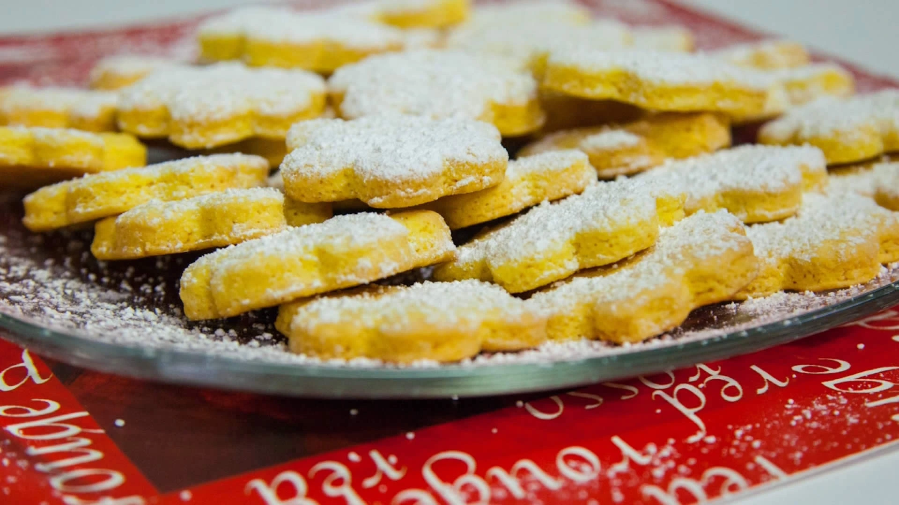

## Ingredienti

| Ingredienti                  | Ingredienti             |
| ---------------------------- | ----------------------- |
| **250 g** - Farina 00 | **1 cucchiaino** - Lievito per dolci |
| **2 cucchiai** - Acqua | Sale |
| **1** - Limone non trattato | **20 g** - Tuorli (1 uovo) |
| **1** - Uovo | **50 g** - Burro |
| **100 g** - Zucchero | |

## Procedimento

> Preriscaldare il forno a 180°C

1. Setacciare la farina e versarla in una ciotola insieme a zucchero, un pizzico di sale, lievito e scorza grattugiata di limone.
2. Unire ora gli ingredienti umidi, ovvero un uovo, un tuorlo ed il burro fuso nel microonde oppure a bagnomaria. 
3. Mescolare per bene, prima con il cucchiaio poi a mano, aggiungendo eventualmente un paio di cucchiai di acqua per rendere più facile la lavorazione.
4. Foderate 2 teglie da forno con la carta oleata.
5. Spolverizzare la spianatoia con un po' di farina e stendere la pasta con l'aiuto di un matterello fino ad ottenere uno spessore di circa 4 mm. Non è necessario lasciar riposare la pasta prima di stenderla. 
6. Con l'apposito tagliapasta, ottenere tanti biscotti dalla forma desiderata.
7. Sistemare i biscotti nella piastra da forno, avendo cura di distanziarli leggermente l'uno dall'altro per evitare che, gonfiandosi in cottura, aderiscano.
8. Infornare a 180°C e cuocere per 12 minuti, fino a quando la superficie risulta leggermente dorata.
9. Rimuovere le piastre dal forno e lasciar raffreddare completamente prima di staccare i biscotti.
10. Rimuovere i biscotti e spolverizzarli con dello zucchero a velo prima di servire.
