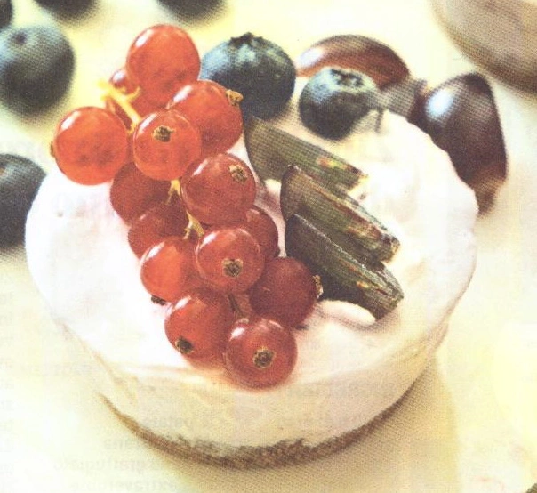

---
tags:
  - Philadelphia
---
# Cheese cake con frutti rossi e briciole di biscotti

## Ingredienti

| Ingredienti                  | Ingredienti             |
| ---------------------------- | ----------------------- |
| **250 g** - Biscotti secchi integrali | **100 ml** - Latte |
| **120 g** - Burro | **200 ml** - Panna |
| **450 g** - Formaggio spalmabile | **2 fogli** - Colla di pesce |
| **110 g** - Zucchero a velo | **160 g** - Mirtilli |

## Procedimento

1. Tritare finemente i biscotti secchi con un batticarne o un mixer. Far sciogliere il burro in un pentolino o al microonde e aggiungerlo alla polvere di biscotti. Mescolare per amalgamare bene il composto poi versarlo sulla base di una tortiera con stampo a cerniera. Pressare bene con un cucchiaio e mettere in frigorifero per un'ora.
1. Unire il formaggio spalmabile e lo zucchero a velo e mescolare per amalgamare. Aggiungere il latte e lavorare fino ad ottenere un composto liscio e omogeneo. 
1. Montare la panna e incorporarla lentamente alla crema senza farla smontare, mescolando dall'alto verso il basso.
1. In un pentolino inserire i mirtilli (tenetene qualcuno per la decorazione) assieme ad un cucchiaio abbondante di zucchero. Mettere sul fuoco e mescolare per 5-6 minuti, fino ad ottenere una purea. Frullarla e aggiungerla una volta fredda al formaggio, amalgamando bene.
1. Mettere in ammollo i fogli di colla di pesce, strizzarli e aggiungerli al composto.
1. A questo punto versare il tutto nella tortiera sopra i biscotti. Mettete in frigo per due ore, decoratela con mirtilli e ribes.
