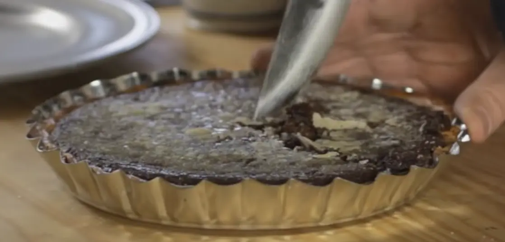

# Chocolate custard per torte

## Ingredienti

| Ingredienti                  | Ingredienti             |
| ---------------------------- | ----------------------- |
| **4** - Rossi d'uovo | **15,6 g** - Latte (1 tblsp) |
| **10 g** - Farina di riso (1 tblsp) | **1 pizzico** - Sale |
| **484 g** - Panna (1 pinta) | **38 g** - Zucchero (3 tblspoon) |
| **140 g** - Cioccolato grattugiato (5 once) |  |

## Procedimento

> Preriscaldare il forno a 180°

1. Si mescolano i rossi d'uovo, la farina, il latte e il sale e si sbattono leggermente
1. Si fa bollire la panna
1. Si aggiunge la cioccolata e lo zucchero
1. Si toglie dal fuoco, si fa raffreddare leggermente e si aggiungono un paio di cucchiai alle uova, mescolando bene
1. Si aggiungono le uova alla panna e cioccolato
1. Si rimette a bollire e si fa addensare (1/2 minuti)
1. Si versa in una base per pie
1. si informa per 45 minuti a 180 gradi
1. si spolvera di zucchero a velo e si fa caramellare con il calore
1. si lascia raffreddare completamente
