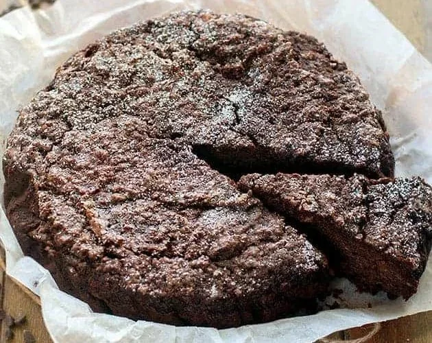

---
tags:
  - Pane raffermo
  - Cacao
---
# Torta di pane

## Ingredienti

| Ingredienti                  | Ingredienti             |
| ---------------------------- | ----------------------- |
| **250 g** - Pane raffermo | **70 g** - Cacao amaro in polvere |
| **500-600 ml** - Latte | **1 bustina** - Lievito per dolci |
| **2** - Uova | **1 cucchiaino** - Estratto di vaniglia |
| **150 gr** - Zucchero semolato | **200 g** - Gocce di cioccolato |
| **80 g** - Olio di semi (o burro fuso) | Zucchero a velo |

## Procedimento

> Preriscaldare il forno a 180°

1. Prima di tutto ammorbidite il pane nel latte caldo. Aggiungetelo a poco a poco, in modo da valutare se necessita di tutti i 500 ml. Nel caso il pane fosse molto duro, dovrete aggiungerne un pochino in più. Il risultato dev'essere un composto morbido, non acquoso ma spugnoso
1. Aggiungete la vaniglia
1. A parte, montate le uova con lo zucchero e a mano a mano amalgamate l'olio a filo. Dovrete ottenere un composto di uova gonfio e chiaro.
1. Frullate con le fruste elettriche il pane e latte fino ad ottenere un impasto morbido privo di pezzi.
1. Versate la montata di uova nell'impasto e amalgamate con una spatola dall'alto verso il basso. Aggiungete quindi il cacao e il lievito precedentemente setacciati
1. Amalgamate insieme con una spatola e aggiungete le gocce di cioccolato.
1. Versate l'impasto della torta di pane in una teglia foderata di carta da forno, livellate bene, aggiungete 2 cucchiai di zucchero semolato
1. Cuocete in forno statico a 180° ben caldo per circa 40-45 minuti. lo stecchino deve uscire asciutto.

