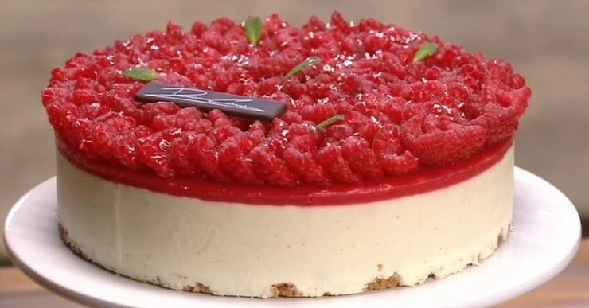

---
tags:
  - Lamponi
  - Fragole
  - Philadelphia
---
# Cheesecake ai lamponi di Damiano Carrara

## Ingredienti

**Crumble**

| Ingredienti                  | Ingredienti             |
| ---------------------------- | ----------------------- |
| **75 g** - Burro | **75 g** - Farina di mandorle |
| **75 g** - Zucchero | **75 g** - Farina 00 |

**Crema**

| Ingredienti                  | Ingredienti             |
| ---------------------------- | ----------------------- |
| **250 g** - Formaggio spalmabile | **25 g** - Succo di limone |
| **40 g** - Tuorli | **75 g** - Zucchero semolato |
| **180 ml** - Panna semi montata | **1 bacca** - Vaniglia |
| **50 g** - Mascarpone | Scorza di limone |
| **9 g** - Gelatina idratata | |

**Gelée lamponi e fragole**

| Ingredienti                  | Ingredienti             |
| ---------------------------- | ----------------------- |
| **50 g** - Zucchero | **225 g** - Purea di lamponi |
| **25 g** - Purea di fragole | **5 g** - Gelatina |

## Procedimento

### Crumble

> Preriscaldare il forno a 180°

1. Lavoriamo tutti gli ingredienti insieme, in planetaria o in una ciotola. Dobbiamo ottenere un composto sabbioso.
1. Una volta formato l'impasto, lo sbricioliamo con le mani all'interno di un anello posto su una teglia con carta forno. 
1. Cuociamo in forno preriscaldato e ventilato a 180° per 15 minuti. Lasciamo raffreddare completamente.

### Crema

1. In un pentolino, mescoliamo il succo di limone, i tuorli e lo zucchero semolato. Poniamo sul fuoco e, continuando a mescolare, portiamo a 85°.  
1. Versiamo il composto nel bicchiere della planetaria e montiamo fino a che diventa freddo. 
1. In un'altra ciotola, lavoriamo con una frusta il formaggio spalmabile con il mascarpone, la scorza di limone e i semi della bacca vaniglia. 
1. Aggiungiamo la panna e lavoriamo ancora. 
1. Infine, incorporiamo i tuorli montati ed ormai freddi e la gelatina sciolta. 
1. Coliamo la crema ottenuta all'interno dell'anello con il crumble. 
1. Mettiamo in freezer per almeno 30 minuti.

### Gelée lamponi e fragole

1. Mettiamo la purea di fragole e lamponi nel bicchiere di un mixer insieme allo zucchero. Frulliamo ad immersione, aggiungendo nel frattempo la gelatina a filo.
1. Versiamo il gelèe sullo strato di crema di formaggio e rimettiamo in freezer a raffreddare per 30 minuti. 
1. Sformiamo e decoriamo la torta con i lamponi, foglioline di menta e polvere d'argento.

# Note

Altra ricetta per il crumble: [Crema al mascarpone con crumble e fragole](Crema-al-mascarpone-con-crumble-e-fragole.md)