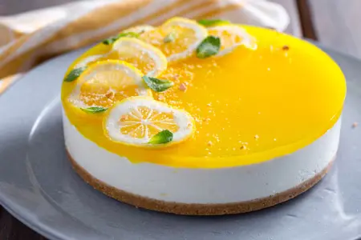

---
tags:
  - Limone
  - Philadelphia
  - Ricotta
  - Panna
---

## Ingredienti

### Base

| Ingredienti                  | Ingredienti             |
| ---------------------------- | ----------------------- |
| **200 g** - Biscotti digestive | **100 g** - Burro |

### Crema

| Ingredienti                  | Ingredienti             |
| ---------------------------- | ----------------------- |
| **500 g** - Ricotta vaccina | **250 g** - Philadelphia |
| **100 g** - Succo di limone (circa 3) | **150 g** - Zucchero a velo |
| Scorza di due limoni | **100 g** - Panna fresca liquida |
| **10 g** - Gelatina in fogli | |

### Glassa

| Ingredienti                  | Ingredienti             |
| ---------------------------- | ----------------------- |
| **60 g** - Succo di limone (Circa 1) | **15 g** - Maizena |
| **100 g** - Acqua | **80 g** - Zucchero |
| **$\frac{1}{4}$ cucchiaino** - Curcuma in polvere | |

per guarnire
Limoni 1
Menta q.b.
Zucchero 100 g
Acqua 80

## Procedimento

### Base

1. Versate i biscotti all'interno di un mixer, poi frullateli fino a ridurli in briciole. Trasferiteli all'interno di una ciotola capiente e unite il burro precedentemente fuso.
2. Mescolate il tutto con un cucchiaio fino ad ottenere un composto uniforme. 
3. A questo punto rivestite di carta forno uno stampo a cerniera da 20 cm (per il bordo meglio una striscia di acetato) e utilizzate il composto di biscotti per ricreare la base della cheesecake pressando delicatamente con il dorso di un cucchiaio. 
4. Riponete la base a rassodare in frigorifero per circa 30 minuti. 

### Crema

1. Mettete la gelatina in ammollo in acqua fredda per circa 10 minuti.
2. Spremete i limoni e filtrate il succo. 
3. In una ciotola versate la ricotta e il formaggio cremoso, mescolate il tutto con una frusta.
4. Aggiungete la scorza dei limoni grattugiata. 
5. Mescolate nuovamente il tutto e unite anche lo zucchero a velo e il succo di limoni continuando sempre a mescolare.
6. A questo punto scaldate la panna in un pentolino, quando avrà sfiorato il bollore spegnete il fuoco, strizzate bene la gelatina e, sempre a fuoco spento, unitela alla panna calda mescolando rapidamente fino a farla sciogliere completamente. 
7. Lasciate intiepidire, poi versate poco per volta all'interno del composto con i formaggi, mescolando per farla amalgamare al meglio.
8. Versate tutto sulla base di biscotti solidificata, livellate la superficie con una spatola e riponetela in frigorifero per almeno 2 ore a rassodare. 

### Glassa

1. Potete preparare la glassa quando mancherà poco allo scadere delle due ore: in un pentolino versate acqua e zucchero.
2. Versate anche il succo di limone filtrato e la maizena. 
3. Mescolate con una frusta mescolate e portate a bollore. 
4. Quando avrà raggiunto il bollore spegnete e versate la curcuma, mescolando per far sciogliere.
5. Lasciate intiepidire, poi versate la glassa sopra la cheesecake e di nuovo in frigo almeno 2 ore a rassodare. 

### Decorazione

1. Per decorare potete tagliare il limone a fettine di circa 1 mm 24.
2. In un pentolino versate acqua e zucchero, portate a bollore e, una volta preso il bollore, spegnete il fuoco e versate lo sciroppo sopra le fette di limone.
3. Lasciate in infusione fino al momento di decorare il dolce.
4. Trascorso il tempo di raffreddamento sformate dalla tortiera il dolce e decorate con le fettine di limone e foglioline di menta.

# Nota

La base puo' essere preparata seguendo la guida per [Cheesecake ai lamponi di Damiano Carrara](cheesecake-ai-lamponi.md)
