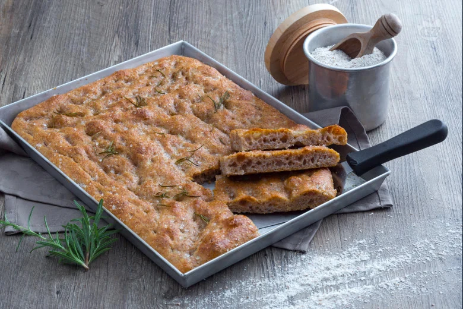

# Focaccia integrale con lievito madre

## Ingredienti

| Ingredienti                  | Ingredienti             |
| ---------------------------- | ----------------------- |
| **400 g** - Farina integrale | **30 g** - Olio evo |
| **100 g** - Farina manitoba | **15 g** - Sale |
| **120 g** - Lievito madre | Rosmarino |
| **400 g** - Acqua a temperatura ambiente | Sale grosso |

### Emulsione

| Ingredienti                  | Ingredienti             |
| ---------------------------- | ----------------------- |
| **65 g** - Olio evo | **65 g** - Acqua |

## Procedimento

> Preriscaldare il forno a 210°

1. Per preparare la focaccia integrale con lievito madre, versate la farina integrale e la farina manitoba nella ciotola di una planetaria munita di gancio, aggiungete il lievito madre già rinfrescato nelle 24 ore precedenti  e l'acqua e azionate per ottenere un impasto liscio.
1. Ora unite il sale e l'olio e lavorate il tutto per circa 10 minuti fino a che non saranno stati completamente assorbiti. Quando l'impasto risulterà liscio e ben incordato versatelo su un piano di lavoro infarinato.
1. Pirlate l'impasto facendolo girare fra le vostre mani per ottenere una forma sferica regolare, poi trasferitelo in una ciotola. A questo punto iniziate a fare la prima piega, sollevando un lembo dell'impasto e portandolo verso il centro.
1. Ruotate la ciotola, prendete un altro lembo dell'impasto e portatelo al centro, poi ruotate nuovamente la ciotola e ripetete l'operazione per altre 2 volte, per un totale di 4 pieghe. 
1. Coprite la ciotola con un canovaccio e lasciate riposare l'impasto per 15 minuti, dopodiché ripetete le 4 pieghe. 
1. Coprite ancora la ciotola e fate riposare per altri 15 minuti, prima di effettuare altre 4 pieghe per la terza e ultima volta. 
1. A questo punto coprite la ciotola con pellicola e lasciate lievitare a temperatura ambiente, lontano da correnti d'aria, per 6 ore. 
1. Trascorso questo tempo, riponete la ciotola in frigorifero e lasciate maturare l'impasto per 18 ore.
1. Trascorso il tempo di maturazione, rimuovete l'impasto dal frigorifero e stendetelo con le mani in una teglia di 35x28 cm ben oliata. Coprite la teglia con pellicola e lasciate lievitare a temperatura ambiente per altre 2 ore 15.
1. Nel frattempo preparate l'emulsione versando l'olio e l'acqua in una ciotolina e mescolando con una forchetta. Una volta lievitata, imprimete i buchi sulla focaccia premendo i polpastrelli nell'impasto; se dovesse risultare faticoso potete ungervi le mani con l'olio. Versate l'emulsione distribuendola su tutta la superficie.
1. In ultimo cospargete con rosmarino e sale grosso a piacere. 
1. Cuocete in forno statico preriscaldato a 210° per circa 30 minuti.
