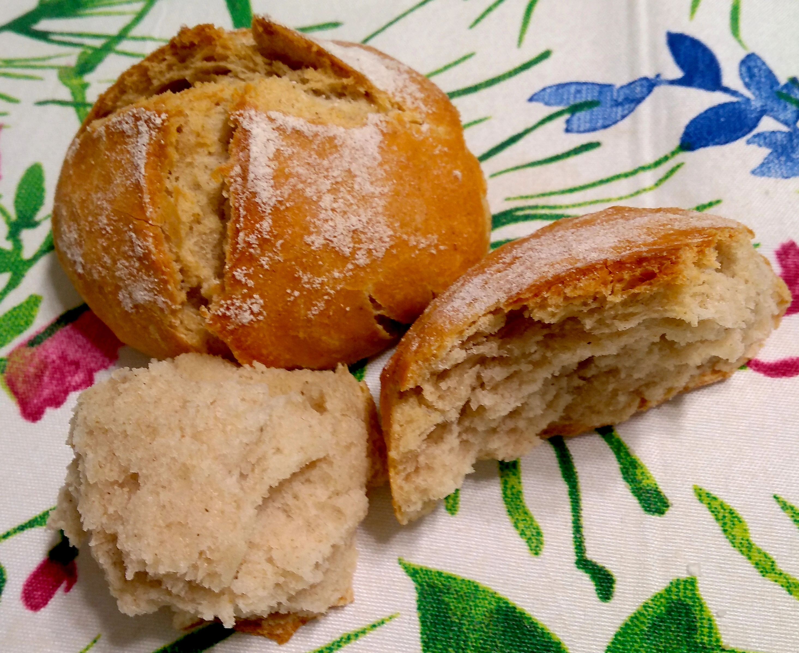

# Panini con lievito madre

## Ingredienti

| Ingredienti                  | Ingredienti             |
| ---------------------------- | ----------------------- |
| **500 g** - Farina manitoba | **100 g** - Lievito madre liquido |
| **250 g** - Acqua | **10 g** - Sale fino |

## Procedimento

> Preriscaldare il forno a 240°

1. Per preparare i panini con lievito madre iniziate dall'impasto: versate in una ciotola capiente la farina, il lievito (rinfrescato e raddoppiato e metà dell'acqua). 
1. Iniziate ad impastare con le mani, poi aggiungete l'acqua restante e impastate ancora con le mani. 
1. Quando l'acqua sarà stata assorbita trasferite l'impasto sul banco da lavoro e continuate ad impastare fino ad ottenere un impasto omogeneo ed elastico. A questo punto aggiungete il sale e continuate ad impastare energicamente per almeno 10 minuti, sino a che l'impasto non risulterà liscio.
1. Ponetelo in una ciotola che avrete precedentemente spennellato con olio, coprite con pellicola e lasciatelo lievitare per almeno ore ad una temperatura di 21-23°. 
1. Trascorso il tempo necessario trasferite l'impasto sul banco da lavoro leggermente infarinato, allargatelo leggermente e dividetelo in due. Prendete il primo pezzo e portate il lembo superiore verso il centro. 
1. Portate poi il lembo inferiore verso il centro, poi fate la stessa cosa con il lembo di destra e quello di sinistra. In questo modo avrete dato 4 pieghe di rinforzo.
1. Fate la stessa cosa per il secondo panetto, coprite con un canovaccio e lasciate riposare per minuti. 
1. Passato il tempo necessario riprendete uno dei panetti e appiattitelo leggermente con le mani.
1. Tagliatelo in quattro parti uguali, e trasferite i panini su una leccarda rivestita con carta forno, distanziandoli bene. Lasciate lievitare per un'ora, quindi prendete un po' di farina e utilizzatela per cospargere i panini. 
1. Togliete poi delicatamente l'eccesso di farina, accarezzandoli con la mano. 
1. Cuocete i panini con lievito madre in forno statico preriscaldato a 240° mettendo alla base del forno una piccola teglia con dell'acqua. Cuocete per circa 30 minuti, poi sfornate e lasciateli raffreddare prima di servirli. 

# Note

Se volete utilizzare il lievito madre solido, al posto di quello liquido, aggiungete 30 g di acqua.