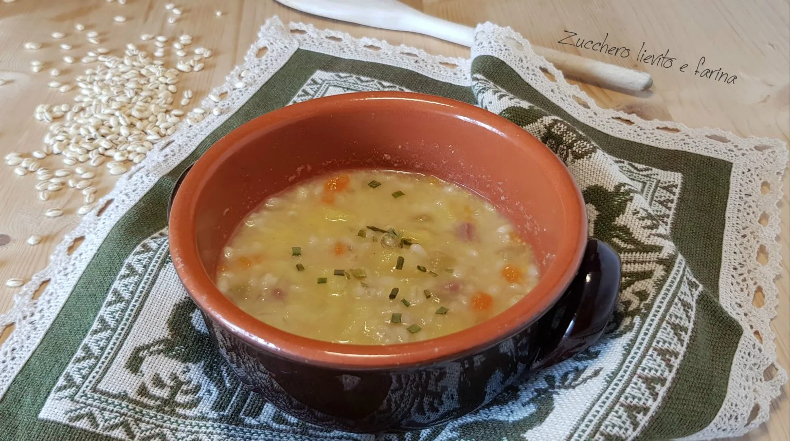

---
tags:
  - Orzo
  - Patate
  - Speck
---

## Ingredienti

| Ingredienti                  | Ingredienti             |
| ---------------------------- | ----------------------- |
| **200 g** - Orzo perlato | **1 gambo** - Sedano |
| **1** - Carota | **1** - Patata |
| **1/2** - Cipolla bianca | **100 g** - Speck |
| **1 l** - Brodo di carne | **2 cucchiai** - Olio evo |
| **10 g** - Burro | Sale e pepe |
| Erba cipollina | |

## Procedimento

1. Per preparare la minestra d’orzo iniziare tagliando a dadini lo speck e le verdure.
2. Mettere l’olio ed il burro in una pentola, preferibilmente di coccio, e soffriggere a fuoco dolce la cipolla. 
3. Aggiungere quindi la dadolata di carote e sedano, insieme allo speck e mescolare per pochi minuti.
4. Unire quindi anche l’orzo precedentemente sciacquato e per ultimo il brodo. 
5. Portare all’ebollizione e cuocere a fuoco dolce per circa 30 minuti.
6. Passati i trenta minuti, unire la dadolata di patate e cuocere ancora per 15 minuti. 
7. Se la minestra si dovesse restringere troppo aggiungere poca acqua o brodo. 
8. Salare con moderazione e aggiungere poco pepe.
9. Preparare un trito di erba cipollina. Impiattare la minestra nelle scodelle e aggiungere poca erba cipollina in ognuna insieme ad una grattugiata di pepe ed un filo d’olio crudo. 
10. Servire immediatamente.
