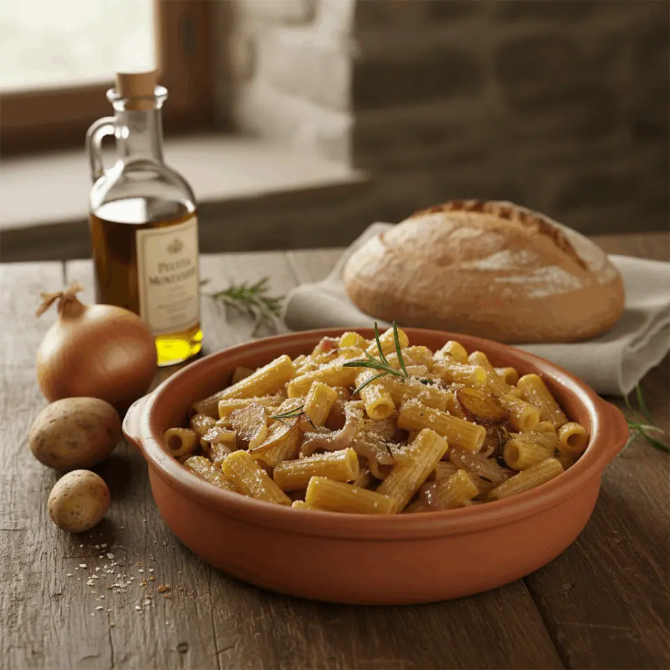

---
tags:
  - Patate
  - Cipolle
---

## Ingredienti

| Ingredienti                  | Ingredienti             |
| ---------------------------- | ----------------------- |
| **320 g** - Pasta | **3** - Patate |
| **2** - Cipolle dorate o bianche | Olio evo |
| Sale e pepe | Rosmarino, timo o alloro |

## Procedimento

1. Pela le patate e tagliale a cubetti piccoli. Affetta sottilmente le cipolle.
2. In una padella larga scalda un generoso giro di olio extravergine d’oliva. Aggiungi le cipolle e falle cuocere a fuoco dolce, senza fretta, finché diventano morbide e leggermente dorate.
3. Unisci le patate, mescola e lascia insaporire qualche minuto. Aggiungi un pizzico di sale e, se ti piace, un rametto di rosmarino o una foglia di alloro. 
4. Versa un mestolino d’acqua calda e lascia cuocere coperto finché le patate sono tenere.
5. Porta a bollore una pentola di acqua salata e cuoci la pasta al dente.
6. Scola la pasta direttamente nella padella con patate e cipolle. Mescola bene, aggiungendo un po’ di acqua di cottura se serve, per legare il condimento. 
7. Completa con un filo d’olio a crudo e, se piace, una macinata di pepe e una spolverata di parmigiano.

## Note

- Varianti di casa
    - Con altri formaggi grattugiati (provola, ricotta salata o pecorino) per una versione più ricca
    - Con pancetta o speck per chi vuole un piatto ancora più sostanzioso
    - Con pane tostato sbriciolato per un tocco rustico
- Questa ricetta si adatta molto bene ai formati di pasta corta come tubetti, ditaloni, mezze maniche o maltagliati. Sono ideali perché raccolgono bene patate e cipolle e rendono il piatto più equilibrato.
- In questa preparazione le patate devono restare morbide ma riconoscibili. L’idea è ottenere un condimento rustico, non una crema.
- Patate e cipolle possono essere cotte qualche ora prima e conservate in frigorifero. Al momento di servire basterà scaldarle dolcemente e saltare la pasta.
- La pasta integrale si abbina bene a questo tipo di condimento rustico e rende il piatto ancora più saziante.