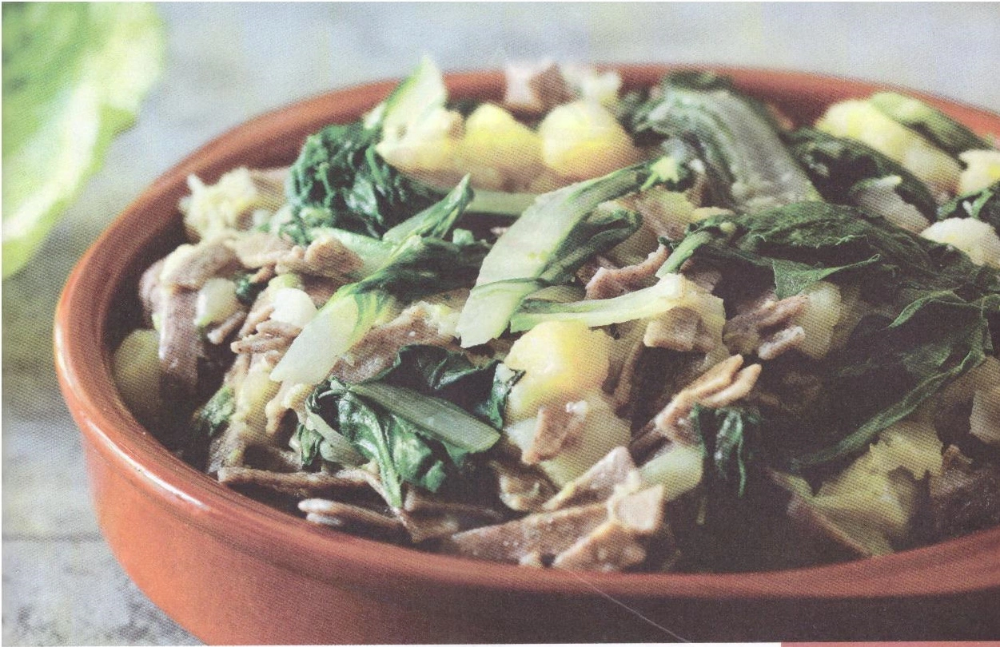

---
tags:
    - Verza
    - Coste
---

# Pizzoccheri con patate e verza

## Ingredienti

| Ingredienti                  | Ingredienti             |
| ---------------------------- | ----------------------- |
| **400 g** - farina di grano saraceno  | **150 g** - Grana padano grattugiato |
| **100 g** - farina bianca | **200 g** - Verze e/o coste |
| **285 g** - acqua tiepida | **250 g** - Patate |
| **200 g** - burro | **1** - Spicchio di aglio |
| **250 g** - formaggio Casera (o Pizzoccherina o Latteria) | Sale e pepe |

## Procedimento

1. Mescolare le farine, formando la fontana. Aggiungere l'acqua e impastare fino a ottenere un impasto elastico e liscio. Con il matterello tirare la sfoglia fino a uno spessore di 2-3 mm e ricavare delle strisce di circa di 7-8 cm. Sovrapporre le fasce e tagliarle nel senso della larghezza, ottenendo delle tagliatelle larghe circa 5mm. Se si appiccicano, spolverare con un pò di farina. 
1. Cuocere le patate a cubetti e la verza in acqua salata finché non diventano tenere. Aggiungere i pizzoccheri nella stessa pentola e far cuocere per circa 5 minuti.
1. Sciogliere il burro con uno spicchio d'aglio ottenendo un bel color nocciola e tagliare il formaggio a cubetti. 
1. Con una schiumarola scolare bene i pizzoccheri e le verdure. Adagiare uno strato di
    pizzoccheri in una pirofila, aggiungere il formaggio a cubetti, il grana grattugiato e continuare fino a finire gli ingredienti.
1. Infine versarvi sopra il burro sciolto. Servire i pizzoccheri con una macinata di pepe.
1. Per questo piatto, a seconda della stagionalità, si possono usare verze o coste.
