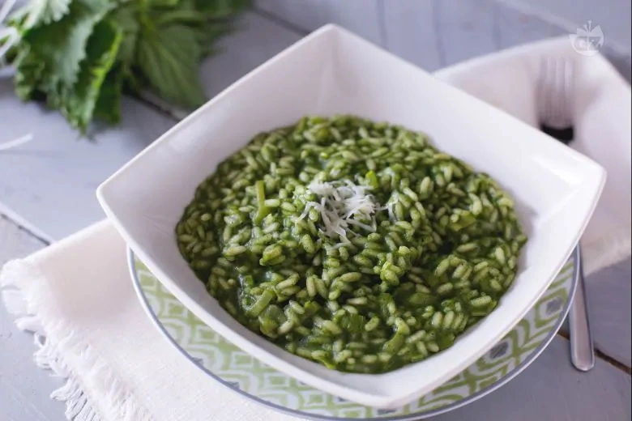

# Risotto alle ortiche

## Ingredienti

| Ingredienti                  | Ingredienti             |
| ---------------------------- | ----------------------- |
| **320 g** - Riso  | **100 g** - Porri |
| **400 g** - Ortiche | **1 l** - Brodo vegetale |
| **30 g** - Olio evo | **40 g** - Burro |
| **50 g** - Vino bianco | Parmigiano reggiano |

## Procedimento

1. Per preparare il risotto alle ortiche come prima cosa iniziate a realizzare il brodo vegetale. A questo punto occupatevi della pulizia delle ortiche: innanzitutto indossate dei guanti per proteggervi le mani dal loro potere urticante, che una volta cotte sparirà. Sfogliate le ortiche eliminando lo stelo: otterrete così circa 200 g di ortiche pulite; poi lavatele in abbondante acqua fredda e ponetele a scolare.
1. Versate 10 gr di olio in un tegame, lasciatelo scaldare poi unite le ortiche, coprite con un coperchio e quando saranno leggermente appassite aggiungete un pò d'acqua (circa 50 gr) che servirà a favorire la cottura.
1. Trascorsi circa 10 minuti le ortiche saranno pronte, spegnete il fuoco e trasferitele all'interno di un bicchiere dai bordi alti e con un mixer ad immersione frullatele, fino ad ottenere una crema liscia. Poi tenetela da parte e passate ad occuparvi del risotto. Prendete il porro eliminate le estremità e affettatelo finemente.
1. In un altro tegame versate la quantità d'olio rimasta, poi unite il porro, lasciatelo appassire a fiamma dolce per 4-5 minuti; quindi aggiungete anche il riso e tostatelo mescolando spesso. Quando avrà cambiato colore sfumatelo con il vino bianco e solo quando tutta la parte alcolica sarà evaporata aggiungete un paio di mestoli di brodo caldo. Cuocete il risotto per circa 5 minuti, poi aggiungete la crema di ortiche, mescolate e ultimate la cottura del risotto continuando ad aggiungere altro brodo caldo solo al bisogno.
1. Una volta che il riso sarà cotto spegnete il fuoco, aggiungete il burro e mantecatelo. A questo punto impiattate il vostro risotto alle ortiche e servitelo con del Parmigiano grattugiato.
