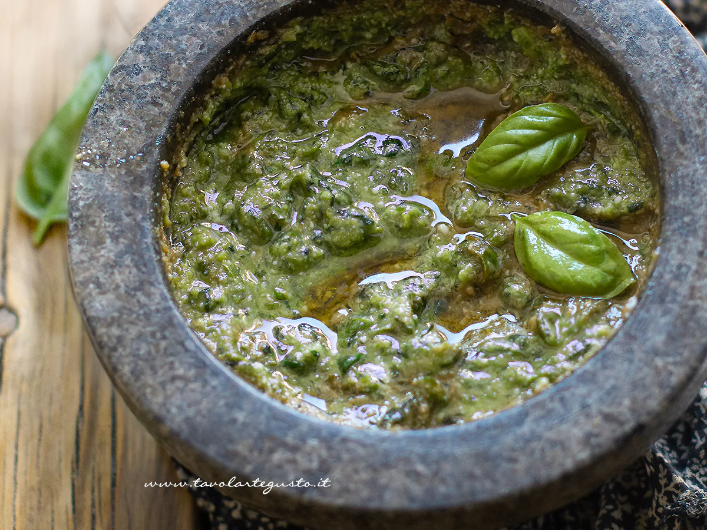

---
tags:
  - Basilico
  - Parmigiano reggiano
  - Pecorino
  - Pinoli
---

## Ingredienti

| Ingredienti                  | Ingredienti             |
| ---------------------------- | ----------------------- |
| **50 gr** - foglie di basilico fresco | **2** - spicchi d’aglio piccoli qualità di Vassalico |
| **80 ml** - Olio evo | **40 gr** - Parmigiano Reggiano|
| **20 gr** - Pecorino fiore sardo| **15 gr** - Pinoli |
| **2 pizzichi** - Sale grosso |  |

## Ricetta tradizionale

### Procedimento

1. Prima di tutto scegliete foglie di basilico giovani, piccole, perfettamente integre e ben asciutte.
2. Lavatele molto delicatamente sotto un filo d’acqua fredda, quindi tamponatele con carta da cucina senza strofinarle, perché tendono ad annerirsi facilmente.
3. Poi pesate i pinoli, l’olio, grattugiate i parmigiano e pecorino e mescolateli insieme e infine sbucciate l’aglio, vi consiglio di privarlo del germoglio interno, che lo rende più pesante e persistente.
4. Prima di tutto inserite nel mortaio l’aglio insieme al sale grosso e pestateli fino a ottenere una crema.
5. Poi aggiungete poco alla volta le foglie di basilico, lavorandole con movimenti rotatori del pestello contro le pareti del mortaio, senza schiacciarle con forza. In questo modo le foglie rilasceranno lentamente i loro oli essenziali.
6. Poi unite i pinoli
7. continuate a pestare fino a ottenere un composto omogeneo.
8. Poi aggiungete Parmigiano e Pecorino, poco alla volta amalgamando bene il tutto e iniziando ad aggiungere l’olio extravergine.
9. Infine completate versate il restante olio poco per volta, continuando a mescolare fino a ottenere una salsa cremosa.
10. Il composto finale dovrà avere la tipica consistenza granulosa e cremosa. 

### Note

- Vi sconsiglio foglie di basilico troppo grandi o con il gambo duro: le più giovani sono decisamente più aromatiche e delicate.
- Ricordate di non stropicciare le foglie: ogni venatura nera che si forma e ogni piega, può compromettere il gusto e il colore del pesto.
- Ricordate che ciò che annerisce il pesto alla genovese è una lavorazione troppo energica o il surriscaldamento. Se necessario quindi fermatevi durante l’operazione per evitare di scaldare e ricominciate finché non avrete ottenuto un composto cremoso e liquoroso.

### Origine

[link](https://www.tavolartegusto.it/ricetta/pesto-alla-genovese-la-ricetta-originale-passo-passo/)

## Con il mixer

1. Far bollire acqua salata
2. Preparare una ciotola con acqua ghiacciata
3. Prendere i gambi di basilico interi e farli sbollentare per 30 secondi
4. Togliere dall'acqua bollente e immergerli immediatamente nell'acqua ghiacciata
5. Prendere con le mani e strizzare completamente.
6. Mettere tutti gli ingredienti nel mixer
7. Frullare per circa 30 secondi
