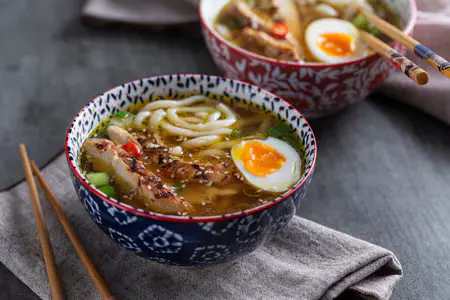

---
tags:
  - Noodles
  - Pollo
  - Zenzero
---

## Ingredienti

### Brodo di pollo

| Ingredienti                  | Ingredienti             |
| ---------------------------- | ----------------------- |
| **1,2 Kg** - Pollo | **3** - Carote |
| **2** - Cipolle dorate | **30 g** - Zenzero fresco |
| **1 Cucchiaio** - Pepe nero in grani | **3 steli** - Lemongrass |
| **20 g** - Salsa di soia | |

### Ramen

| Ingredienti                  | Ingredienti             |
| ---------------------------- | ----------------------- |
| **280 g** - Noodles | **500 g** - Petto di pollo |
| **2** - Uova medie | **20 g** - olio evo |
| **20 g** - Salsa di soia | **1 cucchiaio** - Miele |
| **1 cucchiaio** - Semi di sesamo | **100 g** - Cipollotto fresco |
| **20 g** - Zenzero fresco | **1** - peperoncino fresco |

## Procedimento

1. Brodo di pollo: versate in una pentola capiente un pollo intero pulito insieme alle carote lavate e tagliate a tocchetti, le cipolle mondate e divise, lo zenzero in pezzi, poi aggiungete il pepe nero in grani.
2. Coprite con l'acqua e infine unite il lemongrass sbattuto sul piano e spezzettato a mano. 
3. Lasciate sobbollire il tutto per circa un'ora. 
4. Intanto rassodate le uova in acqua e quando saranno pronte sbucciatele e tagliatele a metà.
5. Passate al petto di pollo: dopo averlo pulito da eventuali nervetti e l'osso centrale, tagliatelo ottenendo delle fettine sottili. 
6. Disponetele in un recipiente e condite con la salsa di soia, l'olio e il miele. 
7. Mescolate e lasciate riposare qualche minuto o finché non avrete notato che il brodo di pollo è finalmente pronto. 
8. Arroventate una griglia e disponete le fette di pollo lasciandole cuocere 3 minuti da un lato e 2 dall'altro.
9. Cospargete il pollo con dei semi di sesamo e tagliate a striscioline sottili. 
10. Versate nel brodo, da cui avrete tolto il pollo e gli altri ingredienti, la salsa di soia.
11. Quindi portate a bollore e tuffate i noodles. 
12. Mentre cuociono tagliate a listarelle lo zenzero pulito e a pezzi trasversali il cipollotto. 
13. Affettate il peperoncino e togliete i semi.
14. Nelle scodelle versate il pollo e lo zenzero, poi il peperoncino e il cipollotto.
15. Infine scolate i noodles. 
16. Irrorate con il brodo e guarnite ogni ciotola con l'uovo.
