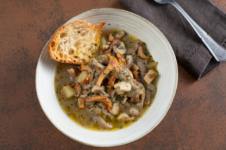

---
tags:
  - Funghi
---

## Senza patate

### Ingredienti

| Ingredienti                  | Ingredienti             |
| ---------------------------- | ----------------------- |
| **350g** - Champignon | **250g** - Pioppini |
| **300g** - Porcini | Brodo di verdure |
| **50g** - Cipolle | **40g** - Sedano |
| **35g** - Carote | Pane |
| **1 spicchio** - Aglio | Olio evo |
| Sale | **1** - Peperoncino |
| **1 ciuffo** - Prezzemolo |  |

### Procedimento

1. Per prima cosa pulite e tagliate i funghi a pezzetti.
2. Poi, possibilmente di terracotta, rosolate in olio extravergine d'oliva un trito fine di cipolla, sedano e carote.
3. Unite il peperoncino a fette e l’aglio.
4. Quando il soffritto sarà ben rosolato, unite gli champignon tagliati a pezzetti ed i pioppini, quindi lasciate rosolare per pochi minuti e salate adeguatamente. Versate subito il brodo fino a coprire il tutto e lasciate andare per 30 minuti.
5. Nel frattempo, fate tostare il pane in forno.
6. Unite anche i porcini a pezzi nel tegame e proseguite per 10 minuti.
7. Servite la zuppa in monoporzioni accompagnata dal pane tostato e prezzemolo tritato.

## Con patate

### Ingredienti

| Ingredienti                  | Ingredienti             |
| ---------------------------- | ----------------------- |
| **200 g** - Porcini | **200 g** - orecchioni o ostrica (Pleurotus) |
| **150 g** - Champignon | **100 g** - Finferli |
| **200 g** - Patate | **1 spicchio** - Aglio |
| **2 rametti** - Rosmarino | **2 rametti** - Timo |
| **1** - Peperoncino | Brodo vegetale |
| Olio evo | Sale e pepe |

### Procedimento

1. Per prima cosa preparate il brodo vegetale e tenetelo in caldo. 
2. Occupatevi della pulizia dei funghi: eliminate il terriccio dal gambo dei porcini con un coltellino, poi sfregate delicatamente con un panno. Separate il cappello dal gambo: tagliate il primo a fette e il secondo a cubotti di circa 2 cm.
3. Pulite gli champignon e tagliateli a spicchi. Dividete anche i finferli e i pleurotus a spicchi, separandoli con le mani.
4. Pelate e riducete le patate a cubetti di 1,5 cm. 
5. Infine tritate finemente gli aghi di rosmarino, il peperoncino e lo spicchio di aglio privato del germoglio interno. 
6. In una casseruola versate un giro d’olio e il trito di rosmarino, aglio e peperoncino.
7. Lasciate insaporire per un minuto, poi aggiungete le patate e mescolate per rosolarle brevemente.
8. Unite i gambi dei porcini, i pleurotus e i rametti di timo.
9. Salate e pepate. Coprite con il brodo vegetale e cuocete per 20 minuti a fuoco dolce. 
10. Trascorso questo tempo aggiungete i finferli.
11. Unite anche gli champignon e le teste dei porcini. 
12. Se necessario versate ancora un po’ di brodo e aggiustate di sale. 
13. Proseguite la cottura per altri 20 minuti. 
14. Nel frattempo tostate le fette di pane in una teglia nel forno statico preriscaldato a 180° per circa 15 minuti.
15. Una volta cotta, impiattate e condite con un filo di olio a crudo e qualche fogliolina di timo. 
