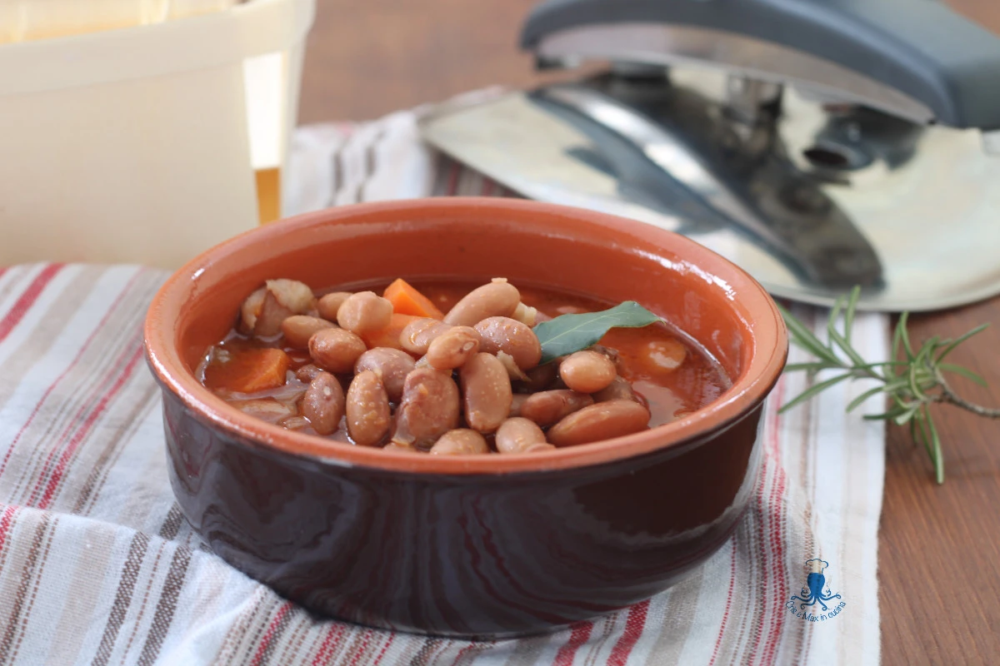

---
tags:
  - Fagioli
---
# Fagioli in umido in pentola a pressione

## Ingredienti

| Ingredienti                  | Ingredienti             |
| ---------------------------- | ----------------------- |
| **250 g** - Fagioli borlotti secchi | **250 g** - Passata di pomodoro |
| Brodo vegetale | **4** - Carote |
| **1/2 costa** - Sedano | **1** - Cipolla bionda |
| **3 cucchiai** - Olio evo | **1 spicchio** - Aglio |
| **1 foglia** - Alloro | Sale fino |
| Peperoncino | |

## Procedimento

1. Per prima cosa mettete a bagno nell’acqua fredda i fagioli borlotti secchi per almeno 12 ore o tutta la notte
2. Pelate le carote e 3 tagliatele a rondelle sottili e una tritatela finemente insieme alla cipolla precedentemente pelata e alla costa di sedano lavata bene e tolto i filamenti.
3. Nella pentola a pressione mettete le verdure tritate, la carota tagliata a rondelle, l’olio extravergine d’oliva, lo spicchio dell’aglio e la foglia di alloro.
4. Fate soffriggere bene, poi aggiungete la passata di pomodoro e i fagioli borlotti precedentemente scolati.
5. Coprite i fagioli con il brodo vegetale, oltre due dita sopra i fagioli, salate bene e se gradite mettete un pezzettino di peperoncino piccante.
6. Coprite con il coperchio, a fiamma medio-bassa fate raggiungere la pressione alla pentola e fate cuocere per 13 minuti.
7. Quando è trascorso il tempo, spegnete il gas e ASPETTATE UN PAIO DI MINUTI prima di far fuoriuscire poco per volta il vapore.
8. Quando avete tolto il coperchio, girate bene i fagioli (controllate la cottura, se necessario fate cuocere ancora qualche minuto).
9. Se vedete che i fagioli risultano troppo asciutti potete aggiungere altro brodo.

