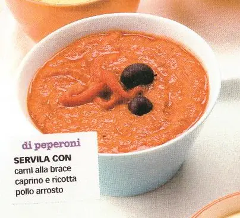

---
tags:
  - Peperoni sottolio
---
# Salsa di peperoni

## Ingredienti

| Ingredienti                  | Ingredienti             |
| ---------------------------- | ----------------------- |
| **300 g** - peperoni sott'olio | **$\frac{1}{2}$ spicchio** - Aglio spellato |
| **1 pizzico** - peperoncino | Olive nere |

## Procedimento

1. Frullare i peperoni con il peperoncino e l'aglio
2. Guarnire con olive nere e qualche fetta di peperone
