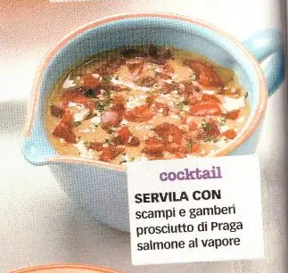

# Salsa rosa (o cocktail)

## Ingredienti

| Ingredienti                  | Ingredienti             |
| ---------------------------- | ----------------------- |
| **200 g** - maionese | Qualche goccia di salsa Worcester |
| **1 cucchiaio** - Whisky | Dadini di pomodoro |
| **2-3 cucchiai** - Ketchup | Prezzemolo |

## Procedimento

1. Mescolare la maionese con il whisky, il ketchup e la salsa Worchester
2. Guarnire con piccoli dadini di pomodoro e prezzemolo
