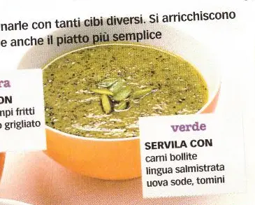

---
tags:
    - Pinoli
    - Prezzemolo
    - Olive verdi
---
# Salsa verde

## Ingredienti

| Ingredienti                  | Ingredienti             |
| ---------------------------- | ----------------------- |
| Grossa manciata di foglio di prezzemolo | **12** - Olive verdi disossate |
| **1 pizzico** - Sale grosso | **1 manciata** - Mollica di pane bagnata in aceto e strizzata |
| **1-2** - Spicchi d'aglio spellato | **4 filetti** - Acciuga |
| **2 cucchiai** - Pinoli | **2** - Uova sode |
| **30 g** - Capperi | **1,5 dl** - Olio evo |

## Procedimento

1. Passare al mixer il prezzemolo e il sale
2. Aggiungere gli altri ingredienti e frullare
