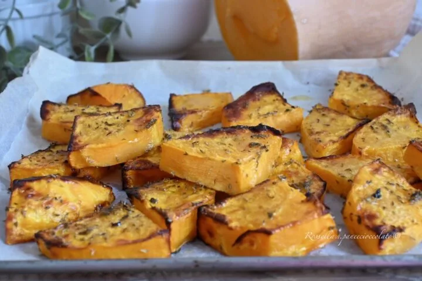

---
tags:
  - Zucca
---

## Ingredienti

| Ingredienti                  | Ingredienti             |
| ---------------------------- | ----------------------- |
| **600 g** - Zucca | **3 cucchiai** - Olio evo |
| **2 cucchiai** - Pangrattato | **2 cucchiai** - Parmigiano |
| **1 spicchio** - Aglio | Sale e pepe |
| Rosmarino | |

## Procedimento

1. Taglia la zucca a fette spesse 1 cm circa, eliminando buccia e semi.
2. Scalda l’olio in una padella antiaderente, aggiungi lo spicchio d’aglio e lascia insaporire.
3. Adagia le fette di zucca in un unico strato e lasciale rosolare a fiamma media.
4. Dopo 5-6 minuti gira le fette (**Attenzione**: si brucia).
5. Cospargi con pangrattato, parmigiano, sale, pepe e aromi scelti.
6. Continua la cottura fino a ottenere una doratura uniforme e una crosticina croccante. 
7. Servi subito, ben calda e croccante.

## Note

- **Speziata**: aggiungi curry o paprika dolce per un tocco esotico.
- **Al formaggio**: gratta sopra scamorza o provola negli ultimi minuti di cottura.
- **In frigo**: si conserva per massimo 2 giorni in un contenitore ermetico.
- **Per rigenerarla**: scaldala in padella senza coperchio per 3-4 minuti.