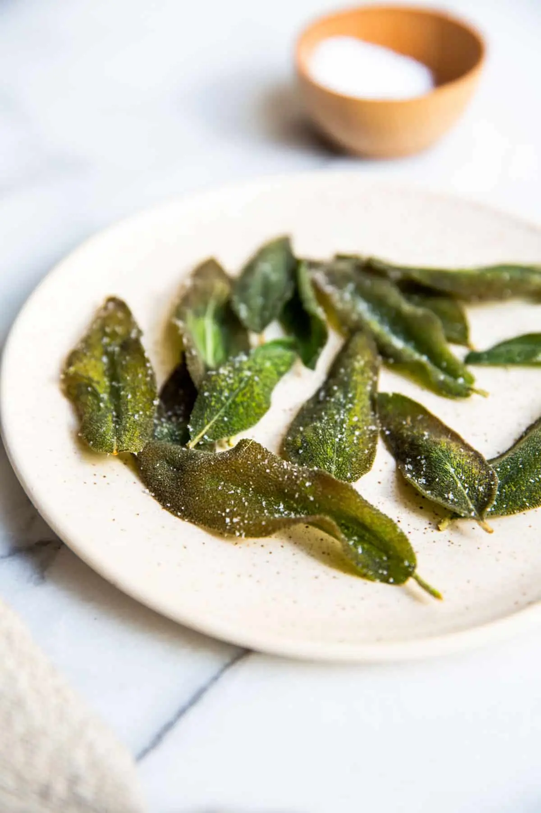

---
tags:
  - Salvia
---
# Salvia fritta

## Croccante

### Ingredienti

| Ingredienti                  | Ingredienti             |
| ---------------------------- | ----------------------- |
| Foglie di salvia | Olio di semi |
| Sale | |

### Procedimento

1. Lavare e asciugare bene le foglie di salvia.
2. Scaldare l'olio a 190° in una padella
3. Gettare alcune foglie di salvia nell'olio e lasciarle friggere per 30-40 secondi
4. Toglierle dall'olio e metterle in un piatto coperto di carta assorbente
5. Salare immediatamente
