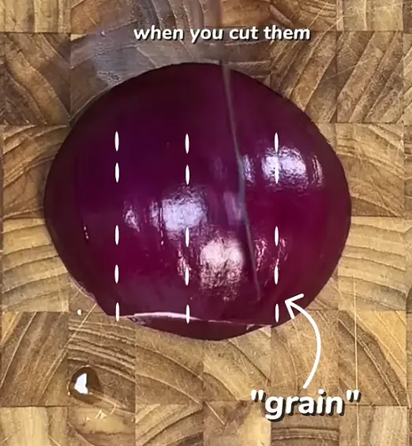
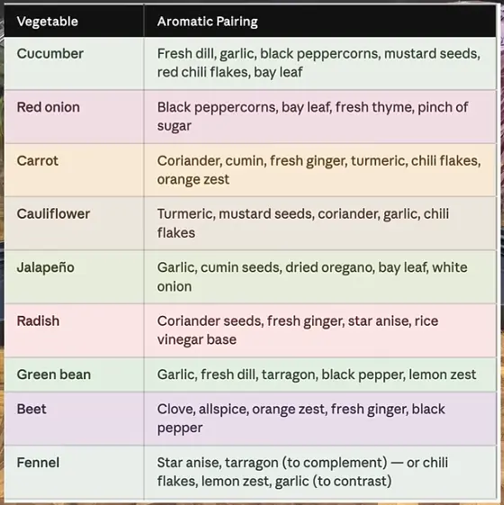

<iframe width="315" height="560"
src="https://www.youtube.com/embed/vW7FIS_UKx4"
title="YouTube video player"
frameborder="0"
allow="accelerometer; autoplay; clipboard-write; encrypted-media; gyroscope; picture-in-picture; web-share"
allowfullscreen></iframe>

## Ingredienti

Attenzione che sono in proporzione, vanno moltiplicate ma i rapporti rimangono

| Ingredienti                  | Ingredienti             |
| ---------------------------- | ----------------------- |
| **1 cup** - Aceto (almeno 5% di acidità) | **1 cup** - Acqua |
| **1 tbsp** - Sale | **1 tbsp** - Zucchero |

## Procedimento

1. Pulire e tagliare a pezzetti le verdure e metterle nei vasetti assieme alle spezie desiderate
2. Mescolare gli ingredienti in una pentola e scaldare (fino quasi all'ebollizione)
3. Coprire i vasetti con la salamoia completamente
4. Chiudere e lasciare in frigo per almeno una notte

## Note

