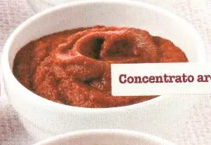

## BAGNET RÖSS. 

### Ingredienti

| Ingredienti                  | Ingredienti             |
| ---------------------------- | ----------------------- |
| **1 Kg** - Pomodori costoluti | **1** - Peperone rosso |
| **1** - Cipolla | **1 spicchio** - Aglio |
| **1** - Carota | **3 cucchiai** - Olio evo |
| Peperoncino | **1 cucchiaio** - Aceto |
| **1 cucchiaino** - Zucchero | Sale |

### Procedimento

1. Lava e taglia a pezzi i pomodori costoluti. 
2. Lava il peperone rosso, taglialo a metà, elimina i semi e le nervature e riducilo a pezzi. 
3. Spella e trita la cipolla e lo spicchio d'aglio. 
4. Pulisci e taglia a dadini la carota. 
5. Riunisci tutte le verdure in una pentola e aggiungi l'olio extravergine, 1/2 peperoncino fresco, l'aceto, lo zucchero e il sale.
6. Cuoci per 1 ora e passa al passaverdura.

## CONCENTRATO AROMATICO

### Ingredienti

| Ingredienti                  | Ingredienti             |
| ---------------------------- | ----------------------- |
| **2** - Scalogni | **1 spicchio** - Aglio |
| **2 cucchiai** - Olio evo | **2 Kg** - Pomodori san Marzano |
| **1 cucchiaino** - Zucchero | **2 rametti** - Timo |
| **1 foglia** - Alloro | |

### Procedimento

1. Rosola in una pentola gli scalogni e lo spicchio d'aglio interi con l'olio extravergine.
2. Unisci i pomodori san Marzano a pezzi, lo zucchero, il timo e la foglia di alloro. 
3. Cuoci per 30 minuti, elimina gli odori e passa i pomodori al passaverdura e regola di sale. 
4. Rimetti la passata nella pentola e cuoci ancora per 2 ore, fino a ottenere una salsa cremosa e concentrata.

## SUGO ALL'ORTOLANA

### Ingredienti

| Ingredienti                  | Ingredienti             |
| ---------------------------- | ----------------------- |
| **500 g** - Pomodori ramati | **2** - Carote |
| **2** - Zucchine | **4** - Coste di sedano |
| **1** - Cipolla | Olio evo |
| Prezzemolo tritato | |

### Procedimento

1. Scotta i pomodori ramati in acqua bollente, spellali e tagliali a pezzi. 
2. Spunta le carote e le zucchine, lavale e tagliale a dadini. 
3. Lava il sedano e riducile a rondelle.
4. Spella la cipolla e tagliala a dadini. 
5. Rosola le verdure in una casseruola con 3-4 cucchiai di olio extravergine. 
6. Aggiungi i pomodori, 1 cucchiaino di zucchero, regola di sale e pepe e cuoci per 45 minuti. 
7. Spegni e aggiungi prezzemolo tritato.

## SALSA PICCANTE

### Ingredienti

| Ingredienti                  | Ingredienti             |
| ---------------------------- | ----------------------- |
| **3 spicchi** - Aglio | **1** - Peperoncino fresco |
| Olio evo | **500 g** - Pomodori pizzutelli |
| Foglie di basilico | |

### Procedimento

1. Spella e taglia a pezzetti 3 spicchi d'aglio.
2. Incidi il peperoncino fresco, nel senso della lunghezza, elimina i semi e tritalo. 
3. Rosola l'aglio e il peperoncino a fuoco basso in una padella con 4 cucchiai di olio extravergine. 
4. Aggiungi i pomodori pizzutelli, spellati e tagliati a pezzettoni. 
5. Unisci 1 cucchiaino di zucchero e cuoci per circa 10-15 minuti. 
6. Regola di sale e aromatizza con 10 foglie di basilico spezzettate.
