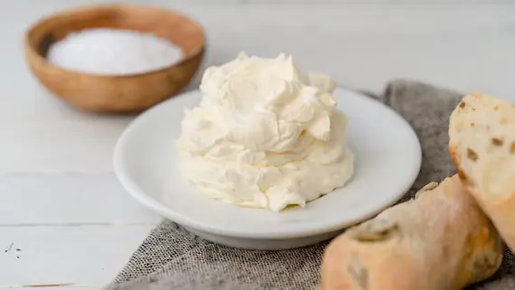

---
tags:
  - Burro
  - Acqua gasata
---

## Che cos’è il burro montato

Il burro montato non è una tipologia a parte di burro rispetto a quello tradizionale che si usa in cucina, ma una sua preparazione che ne modifica la consistenza, facendola diventare cremosa e ariosa, come una specie di spuma che si spalma facilmente. 

Proprio la sua sofficità lo rende differente dal panetto classico che, al contrario, è compatto, ma resta comunque la base di partenza per realizzare questa sfiziosa e versatile variante che può prevedere l’aggiunta di acqua fredda o frizzante per renderlo ancora più leggero e, a seconda dei gusti e degli utilizzi, di un pizzico di sale, così da realizzare un burro montato salato. 

Nulla toglie, poi, di aromatizzarlo a piacere con scorze di agrumi, erbe fresche e spezie, oppure in chiave dolce, per esempio con miele e cannella.

## Come si fa il burro montato: una tecnica da imparare

La bella notizia è che preparare questa specialità è davvero semplice: non si tratta, infatti, di una vera e propria ricetta, ma di una tecnica per far inglobare aria al burro, rendendolo così più leggero e voluminoso. 

- Quello di cui hai bisogno è una materia prima di alta qualità, perché è la protagonista assoluta, e di comune acqua frizzante (calcola per 250 grammi di burro, 70 grammi di liquido). 
- Impiega entrambi a temperatura ambiente perché il burro deve essere facilmente malleabile: tiralo fuori dal frigorifero circa 15-30 minuti prima di metterti all’opera. 
- Quando il burro si è ammorbidito, lavoralo con una forchetta o con una spatola, dando così una consistenza a crema e poi inizia a montarlo con le fruste elettriche o nella planetaria, unendo poca acqua frizzante alla volta, per farla incorporare gradualmente. 
- Se preferisci, puoi montare il burro anche senza aggiungere liquidi: risulterà meno voluminoso ma comunque cremoso e soffice. 
- Per la variante salata, aggiungi il pizzico di sale e poi l’acqua frizzante. 
- Il risultato è un composto spumoso e vellutato, privo di grumi.

## come si utilizza

Il tuo burro montato è pronto: ma come usarlo? Questa preparazione è perfetta per portare in tavola crostini, tartine, canapè per l’antipasto o l’aperitivo. 

Un grande classico è in accompagnamento con le acciughe: spalma il burro soffice su una fetta di pane di segale o realizzato con lievito madre e completa con qualche filetto di acciuga per un piatto semplice, gustoso e raffinato al tempo stesso: anche il salmone affumicato come guarnizione è un must have. 

Il burro montato arricchito con delle erbe fresche e le scorze di arancia o limone grattugiate diventa anche un condimento elegante per un secondo di pesce dalle carni delicate, come la sogliola o il branzino. 

In veste dolce, con un goccio di miele o di sciroppo d’acero a filo, ecco che sostituisce la noce di burro in cima all’iconica torre di pancakes. 

Attenzione a non confondere il burro montato con il burro pomata (beurre pommade): quest’ultimo viene fatto ammorbidire per un’ora (o più) fuori dal frigorifero, acquistando una consistenza molto morbida (simile appunto a quella di una pomata) che lo rende particolarmente adatto per essere montato insieme allo zucchero e altri ingredienti, da utilizzare in impasti base della pasticceria come la frolla montata.

## Gli errori più comuni e come conservarlo

Com’è noto, spesso sono le ricette semplici a nascondere qualche insidia in più proprio perché non ammettono scorciatoie. 

Per avere un burro montato fatto a regola d’arte, la prima cosa da non sottovalutare è proprio la materia prima: scegli un prodotto di alta qualità, profumato e con una percentuale di grassi intorno all’85% (per legge è vietato scendere sotto l’82%), così da ottenere un composto quasi impalpabile, ma ben strutturato, che non si smonta. 

La temperatura ambiente del burro, poi, favorisce la lavorazione: se troppo freddo rischia di spezzarsi, dando come risultato un composto grumoso. 

Inoltre, l’acqua deve essere sempre aggiunta man mano, mai in una volta sola, così da regolare la montata. 

Per godere pienamente della texture e del gusto di questo burro spalmabile, infine, l’ideale è prepararlo poco prima di servirlo (ci vogliono pochi minuti) e, se possibile, consumarlo nell’arco della stessa giornata, in quanto deperibile: inoltre, l’unione di acqua e grassi sappiamo non essere stabile, con i due elementi che tendono a separarsi in modo rapido. Conservalo in frigorifero in un contenitore ermetico e lascialo fuori 5-10 minuti prima di usarlo.
