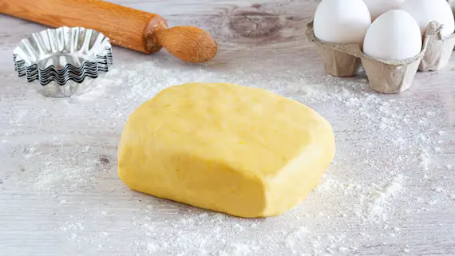

## Ingredienti

| Ingredienti                  | Ingredienti             |
| ---------------------------- | ----------------------- |
| **360 g** - Farina 00 | **240 g** - Burro |
| **120 g** - Burro | **40 g** - Tuorli (2 uova) |
| **1** - Limone non trattato | **1** - Bacca di vaniglia |
| Sale | |

## Procedimento

1. Raccogli per prima cosa in una ciotola lo zucchero semolato, il burro freddo a cubetti, il sale, la vaniglia e la scorza grattugiata del limone.
2. Amalgama velocemente gli ingredienti con le mani, quindi incorpora i tuorli, uno alla volta.
3. Termina con la farina setacciata.
4. Prosegui a impastare fino a ottenere un panetto liscio e omogeneo.
5. Forma una palla, avvolgila con un foglio di pellicola trasparente e fai riposare in frigo per una mezz'ora.
6. Trascorso il tempo di riposo, la pasta frolla di è pronta.

## Note

- Negli Stati Uniti, si prepara con **3 parti di farina, 2 di burro e 1 di zucchero**, cui vengono aggiunti tuorli, scorza di limone e, come ingrediente in più, i semi di una bacca di vaniglia, qui sostituiti con un cucchiaino di estratto.
